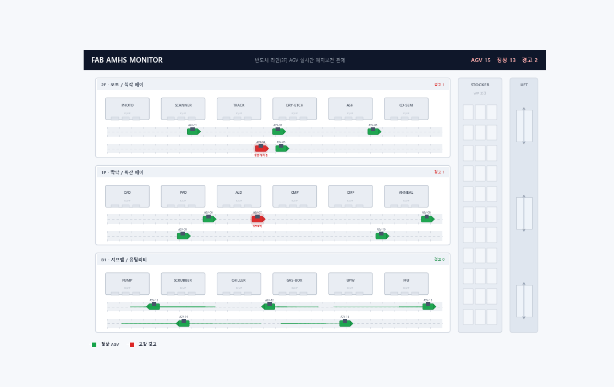
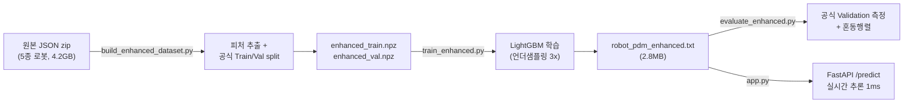
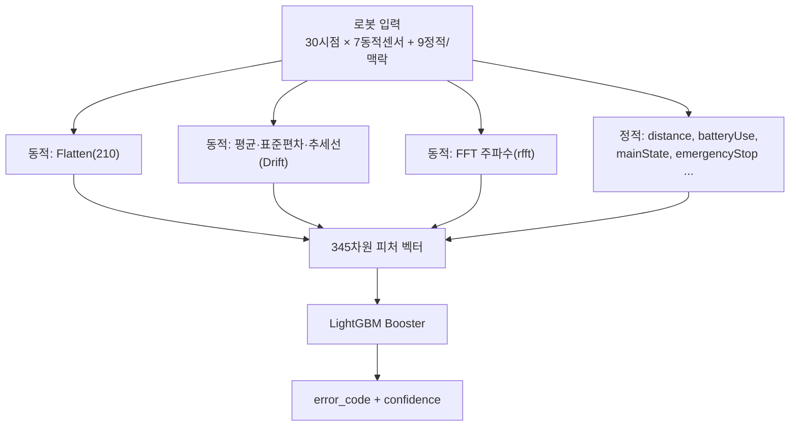

<div align="center">

# 🤖 서비스 로봇 실시간 예지보전(PdM) AI 파이프라인

### _5종 서비스 로봇의 센서 스트림으로 고장을 0.01초 내에 예측하는 경량 실시간 진단 시스템_


**모델 2.8MB · 추론 1ms · GPU 불필요 · CPU 단독 동작 · 실시간 관제 대시보드 포함**

<br>



</div>

---

## 📌 한눈에 보기

| 항목 | 내용 |
|---|---|
| **목표** | 5종 서비스 로봇(안내·배송·서빙·물류·청소)의 다채널 센서로 **9가지 상태(정상 + 8종 고장)**를 실시간 진단 |
| **데이터** | AI-Hub *실내공간 유지관리 서비스 로봇* 공개 데이터셋 (원본 4.2GB, JSON 100만+ 레코드) |
| **모델** | LightGBM (native txt, **2.8MB**) — 시계열을 2D로 압축해 트리 모델로 초고속 추론 |
| **성능** | **공식 Validation(처음 보는 로봇) 93.4%** · 관행적 랜덤분할 환산 **97.7%** (아래 표 참고) |
| **서빙** | FastAPI 추론 API (`/predict`, `/health`) — 입력 검증·지연 0.01초 |
| **개발** | 1인 풀스택 (데이터 파이프라인 → 모델링 → API 서빙 → 평가 전 과정) |

---

## 📊 성능 — *두 개의 정직한 숫자*

> 단일 정확도 자랑이 아니라, **측정 방법까지 명시**해 신뢰도를 확보했습니다.

| 측정 방법 | 정확도 | macro-F1 | 설명 |
|---|:---:|:---:|---|
| **① 공식 Validation split** | **93.4%** | 0.72 | 데이터셋이 분리해 둔 검증셋. **학습에 한 번도 안 쓰인 로봇**으로 평가 → 실배포에 가장 근접 |
| **② 관행적 랜덤분할** | **97.7%** | 0.83 | 전체를 무작위 분할(일반적인 벤치마크 방식). 같은 로봇이 train/test에 섞여 점수가 관대 |
| 기준선(무조건 '정상') | 83.0% | — | 모델이 반드시 이겨야 할 최소선 |

**왜 두 숫자인가?** ②는 대부분의 캐글/논문이 쓰는 방식이라 비교용으로, ①은 *실제 현장처럼 처음 보는 장비*에서의 성능을 보기 위해 함께 제시했습니다. 이 갭(97.7% → 93.4%)을 인지·측정하는 것 자체가 **과적합과 일반화를 이해한다는 증거**입니다.

---

## 🏗️ 파이프라인 아키텍처



### 추론 시 피처 엔지니어링 (서빙·학습 100% 동일)



---

## 🚀 엔지니어링 스토리 — *의사결정의 기록*

### 1. 왜 RNN을 버리고 LightGBM인가 — 실시간성 우선
30시점 시퀀스를 GRU/LSTM(`src/archive/`에 실험 보관)으로 처리하면 정확하지만, 관제 서버에서 연산 과부하·지연이 발생합니다. 시계열을 **2D로 Flatten**하고 트리 기반 LightGBM으로 전환 → **추론 1ms, GPU 불필요, 모델 2.8MB**. *"하드웨어 리소스를 의식한 경량화"*를 모델 선택 단계에서 관철.

### 2. 정답률의 진짜 레버 — *버려진 신호의 복원*
초기 파이프라인은 센서 7개만 사용했지만, 원본 JSON에는 **마모·노화를 직접 가리키는 누적·맥락 신호**가 더 있었습니다. 이를 복원했더니 **피처 중요도 1·2·3위가 모두 복원한 피처**였습니다 — 모델 튜닝이 아니라 *데이터 이해*가 성능을 끌어올린다는 증거.

| 순위 | 복원 피처 | 물리적 의미 | 직결 고장 |
|:---:|---|---|---|
| 1 | `distance` | 누적 주행거리 | 구동부 마모 |
| 2 | `batteryUse` | 누적 배터리 소모 | 배터리 노화 |
| 3 | `mainState` | 로봇 동작 상태 | 상태별 이상 패턴 |


여기에 **추세선(Drift)·FFT(주파수)** 피처를 수학적으로 추출해 2D 압축으로 유실된 시간 흐름을 보강했습니다.

> 🔍 **일반화를 위한 발견 — 절대좌표 암기 제거**: 초기 모델은 피처 중요도에 `x_t29`(절대 위치)가 높게 잡혔습니다. 검증 결과 *사이트마다 좌표계가 달라* 모델이 위치를 암기하는 과적합이었고, **절대 좌표 x·y를 제거해도 공식 Validation 정확도가 93.3%로 동일**함을 확인했습니다. → 위치 대신 `degree`(진행각 동역학)·누적 마모 신호에 집중하는, 새 현장에서도 일반화되는 모델로 정제.

### 3. 극단적 불균형 극복 — 실험으로 찾은 최적점
정상 83% vs 일부 고장 수십 건의 극단적 불균형. SMOTE 강제 증식은 정확도를 붕괴시켜 폐기하고, **정상 클래스를 에러 총합의 3배로 언더샘플링**하는 지점이 정확도·macro-F1을 동시에 최적화함을 그리드 실험으로 확정(2x/3x/5x 비교).

### 4. 데이터 본질적 한계의 규명 (EDA)
일부 고장(`E-RBT-N`·`E-RBT-S`)은 검증셋 표본이 1·14건에 불과하고 정상의 노이즈 범위와 중첩되어, **알고리즘이 아닌 센서·표본의 한계**임을 규명(`analyze_6.py`). → *차기 이기종 센서(소음·전류 등) 도입의 논리적 근거*로 연결.

---

## 🧪 클래스별 성능 (공식 Validation 기준)

| 고장 코드 | F1 | 비고 |
|---|:---:|---|
| `E-RBT-E` (긴급정지 계열) | **0.998** | 매우 우수 |
| `E-RBT-B` (배터리 계열) | **0.912** | 우수 |
| `E-ENV-O` / `E-ENV-C` (환경) | 0.79 / 0.77 | 양호 |
| `정상` | **0.963** | 오경보 최소화 |
| `E-INF-A` / `E-RBT-S` / `E-RBT-N` | 낮음 | 표본 1~360건, *센서 한계 구간* |

<table>
<tr>
<td></td>
<td></td>
</tr>
</table>

> 혼동행렬을 보면 잘못 분류된 고장 대부분이 **'정상' 열로 흡수**(미탐)됩니다. 표본이 1~360건뿐인 `자동문연동·센서이상·네트워크끊김`이 그 대상으로, *알고리즘이 아니라 데이터 한계*임을 한눈에 보여줍니다.

---

## 🖥️ 실시간 관제 대시보드 (디지털 트윈)

`dashboard.py` — **실제 로봇 궤적**을 건물 도면 위에 재생하면서, 학습된 모델이 각 로봇의 30시점 윈도우를 진단하고 **고장 예측 시 실시간 경고**를 띄우는 관제 화면입니다.


- 🗺️ **플로어 맵**: 5종 로봇 10대가 실제 좌표·진행방향(degree)으로 이동, AI 진단에 따라 🟢정상/🔴경고 색상
- 🚨 **실시간 경고 피드**: 고장 예측 로봇을 카테고리(환경/인프라/로봇본체)·신뢰도와 함께 표시, 실제 라벨과 대조(🎯정답 표기)
- 📊 **KPI**: 가동 로봇·정상·경고 수·운영 건전도 실시간 집계
- ▶️ 재생/정지·속도·프레임 스크럽 컨트롤

```bash
cd src
python build_enhanced_dataset.py   # (최초 1회) 원본→데이터+표시정보
python build_replay.py             # 재생용 데이터+예측 사전계산
streamlit run dashboard.py         # 관제 화면 실행
```

> 재생 데이터의 진단은 모델이 학습 때 보는 윈도우와 **100% 동일**하게 사전계산되어, 화면의 진단이 곧 실제 모델 성능(공식 Validation 93.4%)입니다.

---

## 🛠 기술 스택

**Language & Runtime**


**Data & ML**


**Backend / Serving**


**Visualization / Monitoring**


**기법:** 시계열 2D 압축 · FFT 주파수 피처 · 추세선(Drift) 피처 · 클래스 불균형 언더샘플링 · 공식 Train/Val 분리 평가 · native 모델 직렬화(경량 배포)

---

## 📂 프로젝트 구조

```text
ServiceRobot_AI/
├── data/processed/
│   ├── robot_pdm_enhanced.txt        # ✅ 최종 모델 (2.8MB, git 포함)
│   ├── robot_pdm_enhanced_meta.json  # 클래스·피처·성능 메타
│   └── enhanced_meta.json            # 인코딩 맵(deviceType/mainState/crowd)
├── src/
│   ├── build_enhanced_dataset.py     # ① 원본 zip → 피처 + 공식 split + 재생 표시정보
│   ├── train_enhanced.py             # ② 학습 + 공식 Validation 평가
│   ├── evaluate_enhanced.py          # ③ 저장 모델 독립 측정 + 혼동행렬
│   ├── app.py                        # ④ FastAPI 실시간 추론 서버
│   ├── build_replay.py               # ⑤ 대시보드 재생 데이터 + 예측 사전계산
│   ├── dashboard.py                  # ⑥ Streamlit 실시간 관제 대시보드
│   ├── analyze_6.py                  # 센서 한계 규명 EDA
│   └── archive/                      # 초기 실험 20여종(GRU/LSTM/DNN/SMOTE/Optuna…)
├── requirements.txt
└── README.md
```

---

## 💻 실행 방법 (Quick Start)

```bash
# 0) 환경
python -m venv venv && source venv/Scripts/activate   # Windows: venv\Scripts\activate
pip install -r requirements.txt

# 추론만 할 경우 — 데이터·학습 불필요 (모델이 repo에 포함)
cd src
uvicorn app:app --reload          # http://127.0.0.1:8000/docs 에서 테스트
python evaluate_enhanced.py       # 공식 Validation 재측정 + 혼동행렬

# 처음부터 재현할 경우 — 원본 데이터셋(4.2GB) 필요
python build_enhanced_dataset.py  # 원본 zip → enhanced_*.npz  (수 분)
python train_enhanced.py          # 학습 → robot_pdm_enhanced.txt (약 25초, CPU)
```

### `/predict` 예시
```jsonc
POST /predict
{
  "window": [[batteryLevel, speed, x, y, degree, collision, obstacle], ... 30개],
  "context": { "deviceType": "안내로봇", "mainState": "MOVE", "distance": 47000, "batteryUse": 29 }
}
// → { "error_code": "정상", "category": "정상", "confidence": "99.20%", "action_required": "None" }
```

---

## 🔁 다른 환경에서 이어서 개발하기 (재현성)

이 프로젝트는 **모델(2.8MB)이 git에 포함**되어 있어, 어떤 컴퓨터든 `git clone` 후 바로 추론·시연이 됩니다.
**재학습**까지 하려면 원본 데이터셋(4.2GB, 용량상 git 제외)만 별도 보관하면 됩니다.

| 무엇을 | 어디에 | 다른 PC에서 |
|---|---|---|
| 코드 + 최종 모델(2.8MB) | ✅ GitHub | `git clone` → 즉시 추론 |
| 원본 데이터셋(4.2GB) | 외장하드 / 클라우드 백업 | 재학습할 때만 복사 |
| 중간 산출물(npz 등) | 로컬 생성물 | `build_enhanced_dataset.py`로 재생성 |

> 환경 고정: `Python 3.11` · `requirements.txt`로 동일 버전 설치. 추론은 GPU 없이 CPU만으로 동작합니다.

---

## 🗺️ 로드맵

- [x] 원본 풀 피처 복원 + 공식 Train/Val 분리 평가
- [x] 절대좌표 암기 제거(일반화 개선)
- [x] 경량 모델(2.8MB) native 직렬화 + FastAPI 서빙
- [x] **Streamlit 실시간 관제 대시보드** — 디지털 트윈 + 진단/경고
- [ ] **피처 중요도·혼동행렬 시각화** 이미지 README 첨부
- [ ] **Docker 패키징** — `docker run` 한 줄 배포
- [ ] **ONNX 변환** — 엣지/모바일/타 언어 추론 확장

> 📌 다음 작업 상세 가이드: **[NEXT_STEPS.md](NEXT_STEPS.md)** — 혼자 이어서 개발할 때 "뭐부터 어떻게"를 단계별로 정리

---

<div align="center">

**1인 풀스택 개발** · 데이터 파이프라인 → 모델링 → 서빙 → 평가 전 과정 설계

</div>
