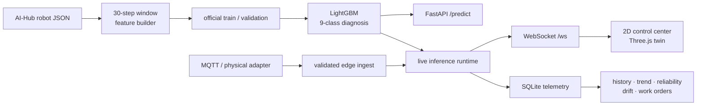

# ServiceRobot_AI

AI-Hub 서비스 로봇 센서 데이터를 이용해 **센서 구간 생성, 고장 진단, 추론 API,
실시간 상태 스트리밍, 2D·3D 관제**를 하나의 실행 흐름으로 연결한 PHM 프로젝트입니다.

[](https://github.com/JuHyeon-Nam/ServiceRobot_AI/actions/workflows/ci.yml)


[GitHub 프로필](https://github.com/JuHyeon-Nam)

## Demo


| 2D control center | Feature importance |
|---|---|
|  |  |

| Per-class F1 | Confusion matrix |
|---|---|
|  |  |

## Project Summary

| Item | Evidence |
|---|---|
| Data | AI-Hub 실내공간 유지관리 서비스 로봇 JSON, 100만 건 이상 |
| Task | 정상과 8개 고장을 구분하는 9-class 상태진단 |
| Input | 30 timesteps, 5개 동적 센서와 9개 context 변수 |
| Feature | flatten·평균·표준편차·drift·rFFT를 결합한 249개 특징 |
| Model | LightGBM native model, 4.30 MiB, best iteration 73 |
| Validation | official accuracy `0.9329`, macro-F1 `0.5838` |
| Serving | FastAPI REST API, WebSocket state stream |
| Interface | Canvas 2D control center, Three.js 3D twin |
| Operations | SQLite history, data QA, drift, reliability, work-order APIs |

`0.9329`는 학습에 사용하지 않은 robot instance로 구성된 official validation split
결과입니다. 희귀 고장 클래스의 표본이 적어 macro-F1이 낮다는 점도 함께 공개합니다.

## Scope and Contribution

- 원본 JSON을 30시점 sensor window로 묶고 학습·검증용 array로 변환
- 통계·변화·주파수 특징을 구성하고 LightGBM 모델 학습·평가
- 학습과 서빙이 동일한 249개 feature contract를 사용하도록 모듈화
- `/predict` 추론 API와 `/ws` 상태 스트림 구성
- 2D 관제와 Three.js 3D twin에서 상태·경고·진단 근거 시각화
- telemetry 이력, drift·data quality·model card, 작업지시 흐름 구현
- 물리 로봇 연결 전환을 위한 MQTT-compatible payload와 edge ingest 경로 구성

## Architecture



## Model Pipeline

### Input contract

- Raw dynamic sensors: `batteryLevel`, `speed`, `x`, `y`, `degree`, `collision`, `obstacle`
- Model dynamic sensors: `batteryLevel`, `speed`, `degree`, `collision`, `obstacle`
- Context: `isOffline`, `nowCharging`, `emergencyStop`, `batteryUse`,
  `batteryCycleCount`, `distance`, `crowd`, `deviceType`, `mainState`
- Output: normal state or one of eight fault codes with confidence

Absolute `x`, `y` coordinates are retained for visualization but excluded from model input.
This prevents the model from treating a site-specific coordinate as a shortcut for a fault.

### Diagnostic classes

| Code | Meaning |
|---|---|
| `normal` | 정상 |
| `E-ENV-C` | 충돌 위험 |
| `E-ENV-O` | 장애물·경로 방해 |
| `E-INF-A` | 자동문 인터페이스 이상 |
| `E-INF-E` | 엘리베이터 인터페이스 이상 |
| `E-RBT-B` | 배터리 이상 |
| `E-RBT-E` | 비상정지 |
| `E-RBT-N` | 네트워크 이상 |
| `E-RBT-S` | 센서 이상 |

## Troubleshooting

### 1. High accuracy hid rare-fault failures

정상 데이터가 약 83%인 환경에서는 accuracy만으로 모델을 평가하면 희귀 고장 미탐을
가릴 수 있었습니다. official split의 macro-F1과 클래스별 F1, confusion matrix를 함께
확인하고, validation support가 매우 작은 고장은 별도 한계로 표시했습니다.

### 2. Coordinates behaved like a site identifier

초기 분석에서 절대좌표가 높은 중요도를 보였습니다. 다른 사이트에서는 좌표계가 달라질
수 있으므로 `x`, `y`를 모델 입력에서 제거하고 이동 방향과 상태·누적 신호 중심으로
feature contract를 다시 구성했습니다.

### 3. Training and serving could diverge

학습 코드와 API가 각각 특징을 만들면 순서·차원이 어긋날 위험이 있었습니다.
`pdm_runtime.py`의 공통 feature builder와 model metadata 검증을 통해 249개 입력 순서를
고정하고, API contract test로 회귀를 확인했습니다.

### 4. A visual demo could be mistaken for a physical deployment

3D 이동과 sensor window는 재현 가능한 replay이며, LightGBM 추론은 각 runtime snapshot에서
실행됩니다. 이를 `/api/data-source`와 model card에 노출하고, 실제 센서는
`/api/edge-ingest` 앞단의 MQTT subscriber 또는 physical adapter로 교체하도록 경계를
분리했습니다.

## Real-time and Operations Layer

| Endpoint | Purpose |
|---|---|
| `POST /predict` | 30-step sensor window 상태진단 |
| `GET /api/snapshot` | AGV 상태·진단·경고 snapshot |
| `WS /ws` | 실시간 fleet state stream |
| `GET /api/history` | asset별 telemetry 이력 |
| `GET /api/trend` | 시간 구간별 상태 집계 |
| `GET /api/data-quality` | 입력 데이터 QA |
| `GET /api/drift` | 기준 운전분포 대비 drift 확인 |
| `GET /api/model-card` | artifact hash·feature contract·한계 |
| `GET /api/work-orders` | 이상 상태를 정비 작업 후보로 변환 |
| `POST /api/edge-ingest` | 검증된 외부 telemetry 입력 |

PHM 위험도와 RUL은 현재 health·trend·sensor signal을 이용한 heuristic입니다.
실제 failure-time label이 확보될 때 supervised regression 또는 survival model로 교체할 수
있도록 dataset builder와 model slot만 구성했습니다. smoke fixture 결과를 현장 성능으로
주장하지 않습니다.

## Run

### Local

```bash
python -m venv .venv
source .venv/bin/activate
pip install -r requirements-server.txt
cd src
uvicorn realtime_server:app --reload
```

- Demo hub: `http://127.0.0.1:8000/demo`
- 2D control center: `http://127.0.0.1:8000/`
- 3D twin: `http://127.0.0.1:8000/twin`
- API docs: `http://127.0.0.1:8000/docs`

### Docker

```bash
docker compose up --build
```

Optional MQTT smoke profile:

```bash
docker compose --profile mqtt-smoke up --build
```

## Test

```bash
pytest -q
```

Tests cover feature contracts, prediction, twin payloads, telemetry storage, edge ingest,
data QA, drift, reliability, work orders and RUL dataset preparation.

## Repository Guide

| Path | Description |
|---|---|
| `src/build_enhanced_dataset.py` | JSON parsing and window generation |
| `src/train_enhanced.py` | LightGBM training |
| `src/evaluate_enhanced.py` | official validation evaluation |
| `src/pdm_runtime.py` | shared feature and inference contract |
| `src/app.py` | inference API |
| `src/realtime_server.py` | WebSocket, twin and operations API |
| `src/telemetry_store.py` | SQLite telemetry layer |
| `src/static/` | 2D, 3D and demo interfaces |
| `docs/MODEL_CARD.md` | metrics, artifact and limitations |
| `docs/PROJECT_STATUS.md` | implemented scope and remaining work |

## Limitations

- Training data is a public service-robot dataset, not a production FAB dataset.
- The 3D twin uses replay trajectories and generated runtime windows.
- Rare classes have low validation support and require additional data collection.
- Physical robot, real broker and external time-series database integration require field validation.
- RUL is not a field-calibrated remaining-life model.

The repository is designed to keep those boundaries visible while showing an end-to-end path from
sensor data to diagnosis, monitoring and maintenance action.
