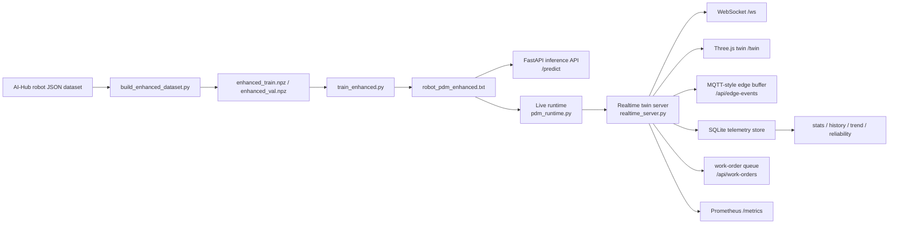

# ServiceRobot_AI

Real-time predictive maintenance system for service robots and FAB-style AGV
fleets. The project combines a lightweight LightGBM fault-diagnosis model,
FastAPI model serving, WebSocket streaming, a 3D digital twin, edge telemetry
contracts, telemetry persistence, reliability metrics, drift monitoring, and
maintenance work-order generation.

[](https://github.com/JuHyeon-Nam/ServiceRobot_AI/actions/workflows/ci.yml)


## Summary

| Area | Implementation |
|---|---|
| Fault diagnosis | 9-class robot state classification: normal + 8 fault codes |
| Model | LightGBM native model, 249 engineered features, CPU inference |
| Validation | Official validation split accuracy `0.9329`; macro-F1 `0.5838` |
| Serving | FastAPI `/predict`, `/health`, `/model-card` |
| Digital twin | FastAPI + WebSocket state stream + Three.js 3D FAB/AGV view at `/twin` |
| Edge telemetry | MQTT-compatible topic/payload contract at `/api/edge-contract`, recent messages at `/api/edge-events` |
| Telemetry store | SQLite event store with history, rollups, CSV export, retention |
| Reliability | MTBF, MTTR, availability, worst assets via `/api/reliability` |
| AI operations | Data quality metrics, drift monitoring, model card, Prometheus metrics |
| Maintenance operations | P1/P2/P3 predictive maintenance work orders via `/api/work-orders` |
| Deployment | Dockerfile and `docker compose up --build` with durable telemetry volume |

## System Architecture



## Model

The model diagnoses one normal class and eight robot fault classes from a
30-step sensor window plus static/context features.

| Item | Value |
|---|---|
| Model artifact | `data/processed/robot_pdm_enhanced.txt` |
| Format | LightGBM native text model |
| Size | 4.30 MiB |
| Feature count | 249 |
| Official validation accuracy | 0.9329 |
| Official validation macro-F1 | 0.5838 |
| Best iteration | 73 |

Fault classes:

- `정상`
- `E-ENV-C`: collision risk
- `E-ENV-O`: obstacle / route obstruction
- `E-INF-A`: automatic door interface fault
- `E-INF-E`: elevator / lift interface fault
- `E-RBT-B`: battery degradation
- `E-RBT-E`: emergency stop
- `E-RBT-N`: network disconnection
- `E-RBT-S`: sensor abnormality

### Feature Contract

Input window:

- 30 timesteps.
- Raw dynamic sensors: `batteryLevel`, `speed`, `x`, `y`, `degree`, `collision`, `obstacle`.
- Model dynamic sensors: `batteryLevel`, `speed`, `degree`, `collision`, `obstacle`.
- Excluded dynamic sensors: `x`, `y`, removed to reduce site-coordinate memorization.
- Static/context features: `isOffline`, `nowCharging`, `emergencyStop`, `batteryUse`,
  `batteryCycleCount`, `distance`, `crowd`, `deviceType`, `mainState`.

Feature engineering:

- Flattened retained time-series values.
- Mean, standard deviation, and drift features per retained dynamic sensor.
- First 15 rFFT magnitudes per retained dynamic sensor.
- Encoded static/context features.

## Runtime Components

| Component | File | Responsibility |
|---|---|---|
| Dataset builder | `src/build_enhanced_dataset.py` | Convert original JSON data into train/validation arrays and replay metadata |
| Trainer | `src/train_enhanced.py` | Train the LightGBM model with the production feature contract |
| Evaluator | `src/evaluate_enhanced.py` | Re-measure saved model performance and generate evaluation artifacts |
| Inference API | `src/app.py` | Serve `/predict`, `/health`, `/model-card` |
| Runtime feature builder | `src/pdm_runtime.py` | Load model artifacts and run live feature generation/inference |
| Realtime server | `src/realtime_server.py` | Stream AGV state, serve `/twin`, expose operational APIs |
| FAB layout | `src/fab_layout.py` | Shared floor, equipment, track, and AGV path definitions |
| Edge gateway | `src/edge_gateway.py` | Convert live AGV state into MQTT-compatible telemetry envelopes |
| Telemetry store | `src/telemetry_store.py` | Persist and aggregate selected warning/low-health events |
| Work-order store | `src/work_order_store.py` | Create and update predictive maintenance work orders |
| Data quality monitor | `src/dataset_quality.py` | Evaluate schema, annotation, QA, and ingest metrics |
| Drift monitor | `src/drift_monitor.py` | Compare live telemetry against the reference operating profile |
| Model card builder | `src/model_card.py` | Publish artifact hash, feature contract, metrics, limitations |

## Quick Start

### Docker Compose

```bash
docker compose up --build
```

Open:

- `http://127.0.0.1:8000/twin`
- `http://127.0.0.1:8000/api/snapshot`
- `http://127.0.0.1:8000/metrics`

Docker Compose persists runtime telemetry in the `telemetry-data` volume:

```yaml
TELEMETRY_DB: /app/data/runtime/telemetry.db
```

### Local Development

```bash
python -m venv .venv
source .venv/bin/activate
pip install -r requirements.txt

cd src
uvicorn realtime_server:app --reload
```

Open `http://127.0.0.1:8000/twin`.

### Inference API

Run the standalone prediction server:

```bash
cd src
uvicorn app:app --reload
```

Example request:

```json
POST /predict
{
  "window": [
    [82.0, 0.7, 12.3, 4.5, 90.0, 0, 0]
  ],
  "context": {
    "deviceType": "안내로봇",
    "mainState": "MOVE",
    "distance": 47000,
    "batteryUse": 29
  }
}
```

The `window` must contain 30 timesteps in normal use. The shortened example
above only illustrates field order.

## Operational APIs

### Realtime State

| Endpoint | Description |
|---|---|
| `GET /twin` | Three.js 3D digital twin |
| `GET /` | 2D realtime control dashboard |
| `WS /ws` | Live fleet state stream |
| `GET /api/layout` | FAB floor/equipment/track layout |
| `GET /api/snapshot` | Current AGV state, KPIs, inference metadata, alerts |

### Telemetry and Reliability

| Endpoint | Description |
|---|---|
| `GET /api/history?agv=AGV-03&limit=200` | Recent events for one AGV |
| `GET /api/history?agv=AGV-03&fmt=csv` | CSV export for one AGV |
| `GET /api/stats` | Session aggregate by level, floor, asset, health |
| `GET /api/trend?bucket=60&n=15` | Time-bucket rollup for trend charts |
| `GET /api/reliability` | Fleet MTBF, MTTR, availability, worst assets |
| `GET /api/reliability?agv=AGV-03` | Reliability metrics for one AGV |

### Edge Telemetry

| Endpoint | Description |
|---|---|
| `GET /api/edge-contract` | MQTT-compatible topic and payload schema |
| `GET /api/edge-events?limit=50` | Recent edge telemetry messages |

Topic pattern:

```text
factory/demo-fab/floor/{floor}/agv/{agv_id}/telemetry
```

Payload groups:

- `position`: x/y coordinate and heading.
- `sensors`: vibration, battery, temperature.
- `diagnosis`: status, fault code, label, confidence, severity level, trend.
- `health`: health index and maintenance advice.
- `source`: inference mode, latency, replay audit field.

### AI Operations

| Endpoint | Description |
|---|---|
| `GET /api/data-quality` | Schema, annotation, QA, ingest, rework metrics |
| `GET /api/drift` | Live feature drift status and recommendation |
| `GET /api/model-card` | Model metadata from the realtime server |
| `GET /model-card` | Model metadata from the inference server |
| `GET /metrics` | Prometheus text-format metrics |

### Maintenance Work Orders

| Endpoint | Description |
|---|---|
| `GET /api/work-orders` | Current predictive maintenance work-order queue |
| `GET /api/work-orders?status=open&limit=20` | Filtered work-order queue |
| `POST /api/work-orders/{order_id}/status?status=in_progress` | Update work-order status |

Supported statuses:

- `open`
- `acknowledged`
- `in_progress`
- `resolved`
- `closed`

Priority rules:

- `P1`: danger-level diagnosis or health index below 30.
- `P2`: warning-level diagnosis or health index below 55.
- `P3`: lower-priority inspection.

## Training and Evaluation

The committed model and replay data are sufficient for inference and the
realtime demo. Rebuilding the dataset requires the original AI-Hub dataset,
which is not stored in this repository.

```bash
cd src
python build_enhanced_dataset.py
python train_enhanced.py
python evaluate_enhanced.py
python build_replay.py
```

The validation split is the primary metric because it evaluates robots not used
during training. Random splitting can produce higher numbers but is less
representative for deployment across unseen robot instances.

## Testing

Run the full test suite:

```bash
.venv/bin/python -m pytest tests -q
```

The tests cover:

- Prediction feature contract and inference API behavior.
- Realtime twin API contracts.
- Live Booster inference fields.
- Telemetry storage, retention, history, rollups, reliability metrics.
- Edge telemetry schema and API contract.
- Work-order creation and status transitions.
- Data quality, drift monitoring, model card, documentation metadata, Docker contracts.

## Repository Layout

```text
ServiceRobot_AI/
├── data/processed/
│   ├── robot_pdm_enhanced.txt
│   ├── robot_pdm_enhanced_meta.json
│   ├── enhanced_meta.json
│   └── replay.parquet
├── src/
│   ├── app.py
│   ├── realtime_server.py
│   ├── pdm_runtime.py
│   ├── edge_gateway.py
│   ├── telemetry_store.py
│   ├── work_order_store.py
│   ├── dataset_quality.py
│   ├── drift_monitor.py
│   ├── model_card.py
│   ├── fab_layout.py
│   ├── static/
│   └── archive/
├── tests/
├── assets/
├── docs/
├── Dockerfile
├── docker-compose.yml
├── requirements.txt
├── requirements-server.txt
└── README.md
```

## Design Notes

- The model artifact is stored as LightGBM native text, avoiding pickle-based
  model loading and keeping CPU-only serving simple.
- Absolute x/y coordinates are excluded from model features to reduce layout
  memorization and improve transfer to different sites.
- The realtime twin runs live LightGBM inference on synthesized 30-step windows;
  replay labels remain as audit metadata.
- SQLite is used for the built-in telemetry and work-order stores to keep the
  runtime self-contained. The edge telemetry contract provides a clear path to
  a real MQTT broker and external time-series database.
- Prometheus metrics expose fleet status, inference latency, edge ingest counts,
  drift status, reliability, telemetry volume, and work-order counts.

## Limitations

- The live digital twin uses replay trajectories and deterministic sensor-window
  synthesis. A physical robot feed should be validated separately.
- Rare fault classes have low validation support, so per-class reliability is
  weaker than aggregate accuracy.
- SQLite is appropriate for a local demo and compact deployment. High-volume
  production telemetry should use a broker plus a time-series database.
- The 3D twin is an operational simulation, not a plant-calibrated layout.
