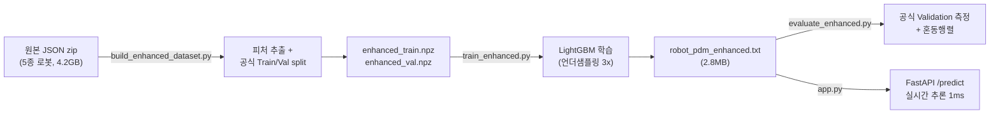
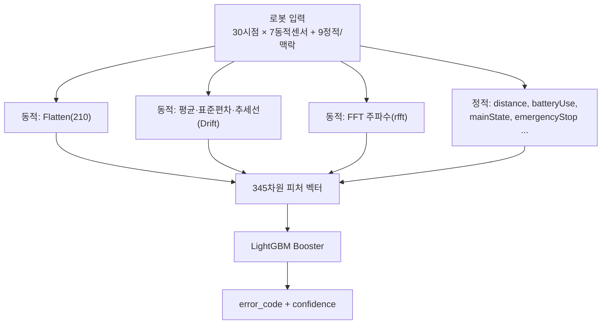
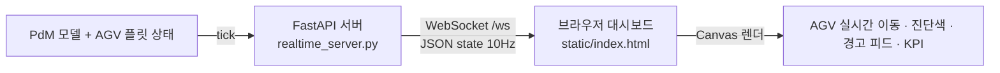
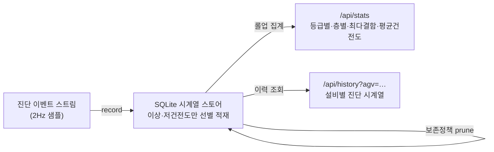

<div align="center">

# 🤖 서비스 로봇 실시간 예지보전(PdM) AI 파이프라인

### _5종 서비스 로봇의 센서 스트림으로 고장을 0.01초 내에 예측하는 경량 실시간 진단 시스템_


[](https://github.com/JuHyeon-Nam/ServiceRobot_AI/actions/workflows/ci.yml)

**모델 2.8MB · 추론 1ms · GPU 불필요 · CPU 단독 동작 · 태블릿 조작 3D 디지털 트윈 관제 · Docker 한 줄 배포**

**For reviewers / research contact:** [교수 컨택용 연구 브리프](docs/professor_contact_brief.md) · [매일 개발 스프린트](docs/daily_sprint_plan.md)

<br>

### 🧊 태블릿으로 조작하는 실시간 3D 디지털 트윈 관제 (`/twin`)

_3개 층 팹을 3D로 — AGV·설비를 실시간 AI 진단, 이상 발생 시 경고빔·자동 카메라 포커스, 설비 탭 → 실시간 센서 그래프(진동·배터리·온도) + AI 판단 근거_


<sub>▶ 실행: <code>cd src &amp;&amp; uvicorn realtime_server:app</code> → <b>http://127.0.0.1:8000/twin</b> (터치로 회전·확대, 설비 탭 → 실시간 AI 진단, 더블탭 시점 리셋 · 풀스크린 · 태블릿 반응형)</sub>

</div>

---

## 📌 한눈에 보기

| 항목 | 내용 |
|---|---|
| **목표** | 5종 서비스 로봇(안내·배송·서빙·물류·청소)의 다채널 센서로 **9가지 상태(정상 + 8종 고장)**를 실시간 진단 |
| **데이터** | AI-Hub *실내공간 유지관리 서비스 로봇* 공개 데이터셋 (원본 4.2GB, JSON 100만+ 레코드) |
| **모델** | LightGBM (native txt, **2.8MB**) — 시계열을 2D로 압축해 트리 모델로 초고속 추론 |
| **성능** | **공식 Validation(처음 보는 로봇) 93.4%** · 관행적 랜덤분할 환산 **97.7%** (아래 표 참고) |
| **서빙** | FastAPI 추론 API (`/predict`, `/health`) — 입력 검증·지연 0.01초 |
| **데이터 QA** | 로보틱스 학습 데이터 스키마·어노테이션·QA 지표 (`/api/data-quality`) |
| **AI 운영 모니터링** | 실시간 입력 분포 드리프트 감지 (`/api/drift`) + Prometheus 게이지 |
| **개발** | 1인 풀스택 (데이터 파이프라인 → 모델링 → API 서빙 → 평가 전 과정) |

---

## 📊 성능 — *두 개의 정직한 숫자*

> 단일 정확도 자랑이 아니라, **측정 방법까지 명시**해 신뢰도를 확보했습니다.

| 측정 방법 | 정확도 | macro-F1 | 설명 |
|---|:---:|:---:|---|
| **① 공식 Validation split** | **93.4%** | 0.72 | 데이터셋이 분리해 둔 검증셋. **학습에 한 번도 안 쓰인 로봇**으로 평가 → 실배포에 가장 근접 |
| **② 관행적 랜덤분할** | **97.7%** | 0.83 | 전체를 무작위 분할(일반적인 벤치마크 방식). 같은 로봇이 train/test에 섞여 점수가 관대 |
| 기준선(무조건 '정상') | 83.0% | — | 모델이 반드시 이겨야 할 최소선 |

**왜 두 숫자인가?** ②는 대부분의 캐글/논문이 쓰는 방식이라 비교용으로, ①은 *실제 현장처럼 처음 보는 장비*에서의 성능을 보기 위해 함께 제시했습니다. 이 갭(97.7% → 93.4%)을 인지·측정하는 것 자체가 **과적합과 일반화를 이해한다는 증거**입니다.

---

## 🏗️ 파이프라인 아키텍처



### 추론 시 피처 엔지니어링 (서빙·학습 100% 동일)



---

## 🚀 엔지니어링 스토리 — *의사결정의 기록*

### 1. 왜 RNN을 버리고 LightGBM인가 — 실시간성 우선
30시점 시퀀스를 GRU/LSTM(`src/archive/`에 실험 보관)으로 처리하면 정확하지만, 관제 서버에서 연산 과부하·지연이 발생합니다. 시계열을 **2D로 Flatten**하고 트리 기반 LightGBM으로 전환 → **추론 1ms, GPU 불필요, 모델 2.8MB**. *"하드웨어 리소스를 의식한 경량화"*를 모델 선택 단계에서 관철.

### 2. 정답률의 진짜 레버 — *버려진 신호의 복원*
초기 파이프라인은 센서 7개만 사용했지만, 원본 JSON에는 **마모·노화를 직접 가리키는 누적·맥락 신호**가 더 있었습니다. 이를 복원했더니 **피처 중요도 1·2·3위가 모두 복원한 피처**였습니다 — 모델 튜닝이 아니라 *데이터 이해*가 성능을 끌어올린다는 증거.

| 순위 | 복원 피처 | 물리적 의미 | 직결 고장 |
|:---:|---|---|---|
| 1 | `distance` | 누적 주행거리 | 구동부 마모 |
| 2 | `batteryUse` | 누적 배터리 소모 | 배터리 노화 |
| 3 | `mainState` | 로봇 동작 상태 | 상태별 이상 패턴 |


여기에 **추세선(Drift)·FFT(주파수)** 피처를 수학적으로 추출해 2D 압축으로 유실된 시간 흐름을 보강했습니다.

> 🔍 **일반화를 위한 발견 — 절대좌표 암기 제거**: 초기 모델은 피처 중요도에 `x_t29`(절대 위치)가 높게 잡혔습니다. 검증 결과 *사이트마다 좌표계가 달라* 모델이 위치를 암기하는 과적합이었고, **절대 좌표 x·y를 제거해도 공식 Validation 정확도가 93.3%로 동일**함을 확인했습니다. → 위치 대신 `degree`(진행각 동역학)·누적 마모 신호에 집중하는, 새 현장에서도 일반화되는 모델로 정제.

### 3. 극단적 불균형 극복 — 실험으로 찾은 최적점
정상 83% vs 일부 고장 수십 건의 극단적 불균형. SMOTE 강제 증식은 정확도를 붕괴시켜 폐기하고, **정상 클래스를 에러 총합의 3배로 언더샘플링**하는 지점이 정확도·macro-F1을 동시에 최적화함을 그리드 실험으로 확정(2x/3x/5x 비교).

### 4. 데이터 본질적 한계의 규명 (EDA)
일부 고장(`E-RBT-N`·`E-RBT-S`)은 검증셋 표본이 1·14건에 불과하고 정상의 노이즈 범위와 중첩되어, **알고리즘이 아닌 센서·표본의 한계**임을 규명(`analyze_6.py`). → *차기 이기종 센서(소음·전류 등) 도입의 논리적 근거*로 연결.

---

## 🧪 클래스별 성능 (공식 Validation 기준)

| 고장 코드 | F1 | 비고 |
|---|:---:|---|
| `E-RBT-E` (긴급정지 계열) | **0.998** | 매우 우수 |
| `E-RBT-B` (배터리 계열) | **0.912** | 우수 |
| `E-ENV-O` / `E-ENV-C` (환경) | 0.79 / 0.77 | 양호 |
| `정상` | **0.963** | 오경보 최소화 |
| `E-INF-A` / `E-RBT-S` / `E-RBT-N` | 낮음 | 표본 1~360건, *센서 한계 구간* |

<table>
<tr>
<td></td>
<td></td>
</tr>
</table>

> 혼동행렬을 보면 잘못 분류된 고장 대부분이 **'정상' 열로 흡수**(미탐)됩니다. 표본이 1~360건뿐인 `자동문연동·센서이상·네트워크끊김`이 그 대상으로, *알고리즘이 아니라 데이터 한계*임을 한눈에 보여줍니다.

---

## 🖥️ 실시간 관제 대시보드 (스마트팩토리 AGV 관제 컨셉)

반도체 라인(FAB)에서 공정 장비 사이를 오가는 **AGV(무인운반로봇) 플릿**을 실시간 모니터링하는 컨셉의 관제 화면입니다. **3개 층(2F 포토/식각 · 1F 박막/확산 · B1 서브팹/유틸리티)** + 스토커 타워 + 층간 리프트로 구성되며, 각 AGV의 30시점 센서 윈도우를 학습된 모델이 진단하고 **고장 예측 시 즉시 경고**(배터리 저하·긴급정지·교차로 충돌위험·층간리프트 연동 등)를 층별로 띄웁니다.


> 📌 데이터·모델은 AI-Hub *서비스 로봇* 공개 데이터지만, 고장 유형(배터리·긴급정지·장애물·충돌위험·층간이송·통신)이 **팹 AGV 예지보전(PdM)에 그대로 대응**되어, 스마트팩토리 AGV 관제로 표현했습니다.

### ⚡ 실시간 스트리밍 관제 (FastAPI + WebSocket)

정적 재생을 넘어, **모델 진단을 실시간으로 흘려보내는 라이브 관제 웹앱**입니다.



- **서버**(`realtime_server.py`): AMHS 트랙 루프를 따라 AGV 위치를 산출하고, 모델 진단을 WebSocket으로 push (`/ws`), 레이아웃 API(`/api/layout`) 제공
- **프론트**(`static/index.html`): WebSocket 구독 → Canvas에 AGV를 부드럽게 보간 렌더(코너 추종), 층별 상태·실시간 고장 경고 피드·KPI를 라이브 갱신
- **공유 레이아웃**(`fab_layout.py`): 층/장비/트랙/AGV 경로의 단일 소스

```bash
cd src
uvicorn realtime_server:app --reload      # http://127.0.0.1:8000 접속 → 라이브 관제
```

#### 🗄️ 시계열 데이터 계층 — 적재 → 집계 → 조회 → 보존 (`telemetry_store.py`)

진단을 화면에 흘려보내고 끝내지 않고, **시계열 데이터로 적재·집계·조회**하는 경량 데이터 파이프라인을 두었습니다. 표준 라이브러리 `sqlite3`만 사용(추가 설치 없음) — 향후 **MQTT 수집 / 외부 시계열DB(InfluxDB·TimescaleDB)** 로 교체해도 동일 인터페이스로 확장됩니다.



| 요소 | 내용 |
|---|---|
| **적재(ingest)** | 매 틱 진단을 2Hz로 샘플, **이상(warn)·저건전도(health<80) 이벤트만 선별 저장**해 저장량 바운드 |
| **집계(rollup)** | `/api/stats` — 세션 누적 총계·등급별/층별 분포·**최다 결함 AGV Top5**·평균 건전도 |
| **다운샘플링(time-bucket rollup)** | `/api/trend?bucket=60&n=15` — **시간 버킷별** 이벤트 수·평균 건전도·등급 집계 (시계열DB의 continuous aggregate 개념) → 관제 HUD **플릿 추이 라인차트**의 데이터 소스 |
| **조회(query)** | `/api/history?agv=AGV-03&limit=200` — 설비 1대의 진단 시계열(시각·신뢰도·건전도·센서) |
| **반출(export)** | `/api/history?agv=…&fmt=csv` — **CSV 다운로드**(리포팅·엑셀 연계), 설비 패널에 `CSV ↓` 버튼 |
| **신뢰성 지표(reliability)** | `/api/reliability` — 이벤트 스트림에서 고장 에피소드를 복원해 **MTBF·MTTR·가용도(Availability)** 계산 (신뢰성 공학 지표), 최저 가용도 설비 Top5 |
| **모니터링(observability)** | `/metrics` — **Prometheus 텍스트 포맷** 게이지(플릿 KPI·적재량·가용도·MTBF/MTTR) → Grafana 등 표준 모니터링 스택에 바로 연동 |
| **데이터 QA(governance)** | `/api/data-quality` — 로보틱스 학습 데이터 레코드의 **스키마 정합성·어노테이션 커버리지·QA 통과율·적재 성공률·재처리율** 계산 |
| **데이터 드리프트(data drift)** | `/api/drift` — 실시간 `vib/batt/temp/health/conf`와 이상 비율을 기준 운전 프로파일과 비교해 **feature-level z-score·watch/drift 등급·재보정 권고** 산출 |
| **보존(retention)** | `max_rows` 초과분 자동 삭제(오래된 이벤트 prune) |
| **저장소** | 기본 인메모리(세션 누적) · 환경변수 `TELEMETRY_DB=경로` 지정 시 파일로 durable |

> 3D 트윈 화면에서 바로 보입니다: 상단 HUD `🗄 세션 적재 N건 · 최다결함 · 평균건전도` + **상단 중앙 플릿 추이 차트**(경고 이벤트·평균 건전도 이중 라인, 20초 버킷) + **설비 탭 → 적재된 이벤트 이력 리스트·CSV 반출**.

- 🗺️ **플로어 맵**: 5종 로봇 10대가 실제 좌표·진행방향(degree)으로 이동, AI 진단에 따라 🟢정상/🔴경고 색상
- 🚨 **실시간 경고 피드**: 고장 예측 로봇을 카테고리(환경/인프라/로봇본체)·신뢰도와 함께 표시, 실제 라벨과 대조(🎯정답 표기)
- 📊 **KPI**: 가동 로봇·정상·경고 수·운영 건전도 실시간 집계
- ▶️ 재생/정지·속도·프레임 스크럽 컨트롤

```bash
cd src
python build_enhanced_dataset.py   # (최초 1회) 원본→데이터+표시정보
python build_replay.py             # 재생용 데이터+예측 사전계산
streamlit run dashboard.py         # 관제 화면 실행
```

> 재생 데이터의 진단은 모델이 학습 때 보는 윈도우와 **100% 동일**하게 사전계산되어, 화면의 진단이 곧 실제 모델 성능(공식 Validation 93.4%)입니다.

---

## 🛠 기술 스택

**Language & Runtime**


**Data & ML**


**Backend / Serving**


**Visualization / Monitoring**


**기법:** 시계열 2D 압축 · FFT 주파수 피처 · 추세선(Drift) 피처 · 클래스 불균형 언더샘플링 · 공식 Train/Val 분리 평가 · native 모델 직렬화(경량 배포)

---

## 📂 프로젝트 구조

```text
ServiceRobot_AI/
├── data/processed/
│   ├── robot_pdm_enhanced.txt        # ✅ 최종 모델 (2.8MB, git 포함)
│   ├── robot_pdm_enhanced_meta.json  # 클래스·피처·성능 메타
│   └── enhanced_meta.json            # 인코딩 맵(deviceType/mainState/crowd)
├── src/
│   ├── build_enhanced_dataset.py     # ① 원본 zip → 피처 + 공식 split + 재생 표시정보
│   ├── train_enhanced.py             # ② 학습 + 공식 Validation 평가
│   ├── evaluate_enhanced.py          # ③ 저장 모델 독립 측정 + 혼동행렬
│   ├── app.py                        # ④ FastAPI 실시간 추론 서버
│   ├── build_replay.py               # ⑤ 대시보드 재생 데이터 + 예측 사전계산
│   ├── realtime_server.py            # ⑥ FastAPI + WebSocket 실시간 관제 서버
│   ├── telemetry_store.py            #    시계열 데이터 계층(SQLite): 진단 이벤트 적재·집계·조회·보존
│   ├── fab_layout.py                 #    팹 도면·AMHS 경로 단일 소스(서버/프론트 공유)
│   ├── static/index.html             #    라이브 관제 대시보드(Canvas + WebSocket)
│   ├── make_floorplan.py             #    팹 AGV 관제 시각화(탑다운 PNG) 생성
│   ├── make_visuals.py               #    혼동행렬·피처중요도 등 차트 생성
│   ├── dashboard.py                  #    Streamlit 재생형 대시보드
│   ├── analyze_6.py                  # 센서 한계 규명 EDA
│   └── archive/                      # 초기 실험 20여종(GRU/LSTM/DNN/SMOTE/Optuna…)
├── requirements.txt
└── README.md
```

---

## 💻 실행 방법 (Quick Start)

```bash
# ⭐ Docker 한 줄 배포 (관제 서버) — CI가 매 push마다 빌드·스모크 테스트로 검증
docker build -t servicerobot-ai . && docker run -p 8000:8000 servicerobot-ai
# → http://127.0.0.1:8000/twin

# 0) 환경 (로컬 개발)
python -m venv venv
source venv/bin/activate      # Windows: venv\Scripts\activate
pip install -r requirements.txt

# 추론·시연 — 데이터·학습 불필요 (모델·재생데이터가 repo에 포함)
cd src
uvicorn realtime_server:app --reload   # ⭐ http://127.0.0.1:8000  실시간 관제 웹앱
uvicorn app:app --reload               # REST 추론 API (/docs 에서 테스트)
python evaluate_enhanced.py            # 공식 Validation 재측정 + 혼동행렬
python make_floorplan.py               # 관제 도면 PNG 재생성 (assets/)
streamlit run dashboard.py             # Streamlit 재생형 대시보드

# 처음부터 재현 — 원본 데이터셋(4.2GB) 필요
python build_enhanced_dataset.py       # 원본 zip → enhanced_*.npz + replay_display (수 분)
python train_enhanced.py               # 학습 → robot_pdm_enhanced.txt (약 25초, CPU)
python build_replay.py                 # 재생 데이터 + 예측 사전계산
```

> 🔧 **트러블슈팅**: ① WebSocket이 안 붙으면 `pip install websockets` 확인. ② 한글이 깨지면(시각화) Windows는 맑은 고딕 기본 포함, mac/linux는 나눔고딕 설치. ③ 모델만 있으면 추론은 되지만 `build_*`/`train_*`은 원본 4.2GB가 필요.

### `/predict` 예시
```jsonc
POST /predict
{
  "window": [[batteryLevel, speed, x, y, degree, collision, obstacle], ... 30개],
  "context": { "deviceType": "안내로봇", "mainState": "MOVE", "distance": 47000, "batteryUse": 29 }
}
// → { "error_code": "정상", "category": "정상", "confidence": "99.20%", "action_required": "None" }
```

---

## 🧑‍💻 개발 가이드 · 코드 팁 (확장하는 법)

> 처음 보는 사람도 바로 손댈 수 있게, "무엇을 어디서 고치는지" 정리했습니다.

**파이프라인 한눈에 (데이터 → 모델 → 서비스)**
```
원본 zip ──build_enhanced_dataset.py──▶ enhanced_train/val.npz + replay_display.parquet
                                            │
                          train_enhanced.py ▼            evaluate_enhanced.py
                          robot_pdm_enhanced.txt(2.8MB) ─────────▶ 공식 Validation 측정
                                            │
                    build_replay.py ▼ (예측 사전계산)
                          replay.parquet ──┬─▶ realtime_server.py + static/index.html (라이브)
                                           ├─▶ make_floorplan.py (탑다운 PNG)
                                           └─▶ dashboard.py (Streamlit)
            도면/경로 단일 소스: fab_layout.py  (서버·시각화 공유)
```

**자주 하는 작업**
| 하고 싶은 것 | 어디를 고치나 |
|---|---|
| 모델 재학습 | `train_enhanced.py` 실행 (피처 함수는 `MODEL_DYN_IDX`로 x,y 제외 — train/eval/app/dashboard **모두 동일해야 함**) |
| 도면에 층·장비·AGV 추가 | `fab_layout.py`의 `FLOORS_DEF`(층·장비), `VX`(트랙 메시), `build_agv_plan()`(AGV 루프) 한 곳만 고치면 **라이브·GIF 둘 다 반영** |
| 재생 로봇 선택/예측 | `build_replay.py` (정확도≥0.8, 에러 보유 우선으로 로봇 선별 후 예측 사전계산) |
| 시각화 이미지 재생성 | `make_floorplan.py`(관제) / `make_visuals.py`(혼동행렬·피처중요도) |
| 실시간 전송 주기 | `realtime_server.py`의 `asyncio.sleep` 값, 진행속도 `P["v"] += …` |

**코드 팁**
- **모델은 `native txt`로 저장**(`booster.save_model`) → 2.8MB·언어 독립·`pickle` 보안 이슈 없음. `lgb.Booster(model_file=...)`로 로드.
- **피처 일관성이 생명**: 동적센서에서 절대좌표 x,y를 빼는 `MODEL_DYN_IDX=[0,1,4,5,6]`가 4개 파일에 동일하게 들어감. 하나라도 어긋나면 예측이 붕괴(과거 실제 디버깅 사례).
- **재생 데이터는 학습 윈도우와 1:1 정렬**: `replay_display.parquet`을 `build_enhanced_dataset.py`가 검증셋과 같은 인덱스로 캡처 → 화면 진단 = 실제 모델 성능.
- **좌표 정규화**: 사이트마다 좌표계가 달라, AGV는 각 트랙 구간에 자기 실제 궤적을 정규화해 배치(겹침 방지 + 코너 추종).

## 🔁 다른 환경에서 이어서 개발하기 (재현성)

이 프로젝트는 **모델(2.8MB)이 git에 포함**되어 있어, 어떤 컴퓨터든 `git clone` 후 바로 추론·시연이 됩니다.
**재학습**까지 하려면 원본 데이터셋(4.2GB, 용량상 git 제외)만 별도 보관하면 됩니다.

| 무엇을 | 어디에 | 다른 PC에서 |
|---|---|---|
| 코드 + 최종 모델(2.8MB) | ✅ GitHub | `git clone` → 즉시 추론 |
| 원본 데이터셋(4.2GB) | 외장하드 / 클라우드 백업 | 재학습할 때만 복사 |
| 중간 산출물(npz 등) | 로컬 생성물 | `build_enhanced_dataset.py`로 재생성 |

> 환경 고정: `Python 3.11` · `requirements.txt`로 동일 버전 설치. 추론은 GPU 없이 CPU만으로 동작합니다.

---

## 🗺️ 로드맵

- [x] 원본 풀 피처 복원 + 공식 Train/Val 분리 평가
- [x] 절대좌표 암기 제거(일반화 개선)
- [x] 경량 모델(2.8MB) native 직렬화 + FastAPI 서빙
- [x] **Streamlit 관제 대시보드** + **FastAPI/WebSocket 실시간 스트리밍 관제**
- [x] **설명가능성(Explainability)** — `/predict`가 진단 근거(물리 신호 Top3) 반환, LightGBM 내장 SHAP로 경량 유지 + pytest
- [x] **3D 디지털 트윈** — `/twin`(Three.js): 3개 층·장비·AGV를 3D로, 태블릿 터치 조작 + 탭→실시간 AI 진단, **설비 탭 시 실시간 센서 그래프(진동·배터리·온도) + AI 판단 근거** (`uvicorn realtime_server:app` → http://127.0.0.1:8000/twin )
- [x] **자산 건전도 지표(Health Index) + 정비 우선순위** — 순간 분류를 넘어 최근 진단 추세를 종합한 0~100 건전도 점수·정비 트리아지 권고(설비 패널) + 플릿 정비 필요 대수·평균 건전도(KPI)
- [x] **시계열 데이터 계층** — 진단 이벤트 SQLite 적재·롤업 집계(`/api/stats`)·설비별 이력 조회(`/api/history`)·보존정책 (무설치, 향후 MQTT/시계열DB 확장)
- [x] **시계열 분석 계층** — 시간 버킷 다운샘플링(`/api/trend`) + 관제 HUD **플릿 추이 차트** + 설비 패널 **이벤트 이력·CSV 반출**
- [x] **신뢰성 지표 + 운영 모니터링** — 고장 에피소드 복원 기반 **MTBF·MTTR·가용도**(`/api/reliability`) + **Prometheus `/metrics`**(Grafana 연동점)
- [x] **Docker 패키징** — `docker run` 한 줄 배포(경량 서버 이미지) + **CI에서 빌드·컨테이너 스모크 테스트 자동 검증**
- [x] **로보틱스 데이터 QA/거버넌스 지표** — `/api/data-quality`: 스키마 정합성·어노테이션 커버리지·QA 통과율·적재 성공률·재처리율
- [x] **데이터 드리프트 감지** — `/api/drift`: 실시간 입력 분포가 기준 운전 프로파일에서 벗어나는지 feature-level z-score·경고 등급·재보정 권고로 감시
- [ ] **MQTT 수집 + 외부 시계열DB 연동** — 엣지 브로커 → 스트림 적재 확장
- [ ] **피처 중요도·혼동행렬 시각화** 이미지 README 첨부
- [ ] **ONNX 변환** — 엣지/모바일/타 언어 추론 확장

> 📌 작업 우선순위·일정: **[ROADMAP.md](ROADMAP.md)** (공채 스프린트) · 단계별 상세: **[NEXT_STEPS.md](NEXT_STEPS.md)**

---

<div align="center">

**1인 풀스택 개발** · 데이터 파이프라인 → 모델링 → 서빙 → 평가 전 과정 설계

</div>


---

## 👨‍💻 My Contribution (남주현 기여도)

이 프로젝트에서 **데이터 파이프라인 구축 및 실시간 추론 아키텍처 최적화**를 전담했습니다. 공식 Validation split 기준 **93.4%**(처음 보는 로봇 평가), 관행적 랜덤분할 기준 **97.7%**를 구분해 기록하여 실배포 일반화 성능과 비교용 성능을 함께 제시했습니다.

*   **초고속 추론을 위한 차원 압축 (3D → 2D Flatten)**
    *   30시점 연속 시퀀스를 RNN 계열로 처리할 때 발생하는 실시간 관제 서버의 연산 과부하 문제를 해결하기 위해, 시계열을 2D 평면으로 Flatten하고 경량 트리 기반 **LightGBM**을 도입하여 0.01초 내 초고속 추론 환경을 구현했습니다.
*   **도메인 맞춤형 피처 엔지니어링**
    *   차원 압축 과정에서 유실된 시간 흐름 데이터를 보완하기 위해 장기 고장용 **추세선(Drift) 피처**와 미세 진동 감지용 **FFT(고속 푸리에 변환) 주파수 피처**를 직접 수학적으로 추출 및 주입하여 고장 예측률을 정체기에서 돌파시켰습니다.
*   **극단적 데이터 불균형 제어**
    *   정상 데이터가 압도적으로 많은 불균형 구조에서 SMOTE 적용 시 성능이 붕괴되는 것을 확인하고, 정상 클래스를 에러 총합의 3배로 언더샘플링하는 지점이 정확도와 macro-F1의 균형을 가장 잘 만든다는 것을 실험으로 확인했습니다.
*   **데이터 본질적 한계의 수학적 증명 (EDA)**
    *   특정 희귀 고장(Class 6)이 정상 데이터의 노이즈 범위와 완벽히 중첩됨을 EDA로 증명하여, 알고리즘 모델의 한계가 아닌 센서 자체의 물리적 한계임을 규명하고 차기 이기종 센서 도입의 논리적 근거를 마련했습니다.

---
