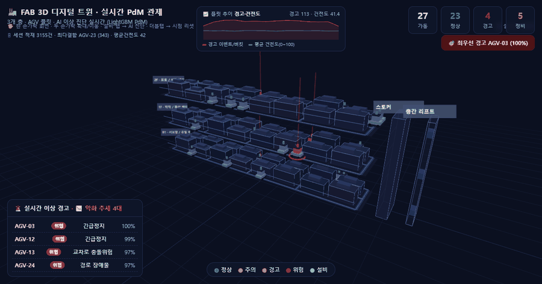
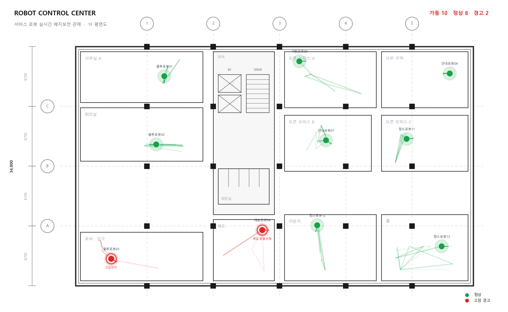
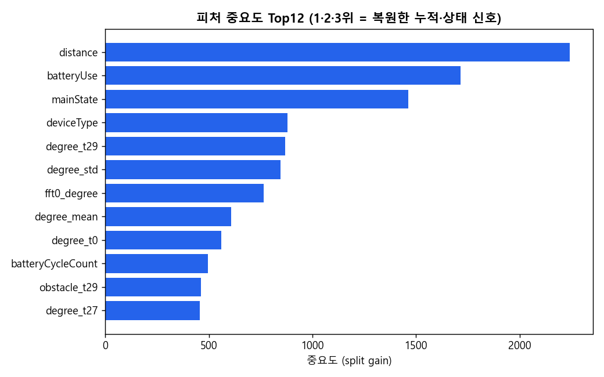
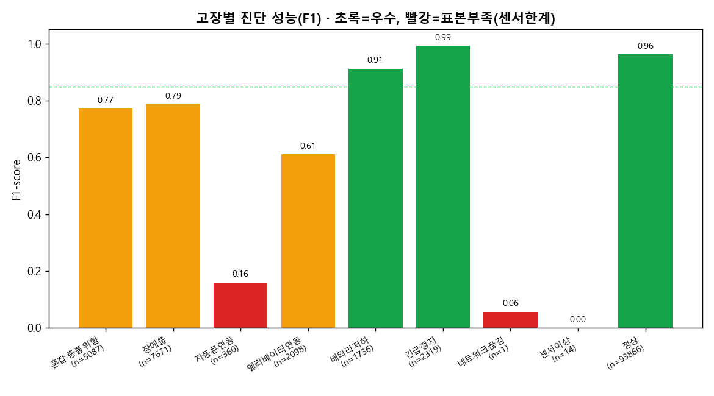
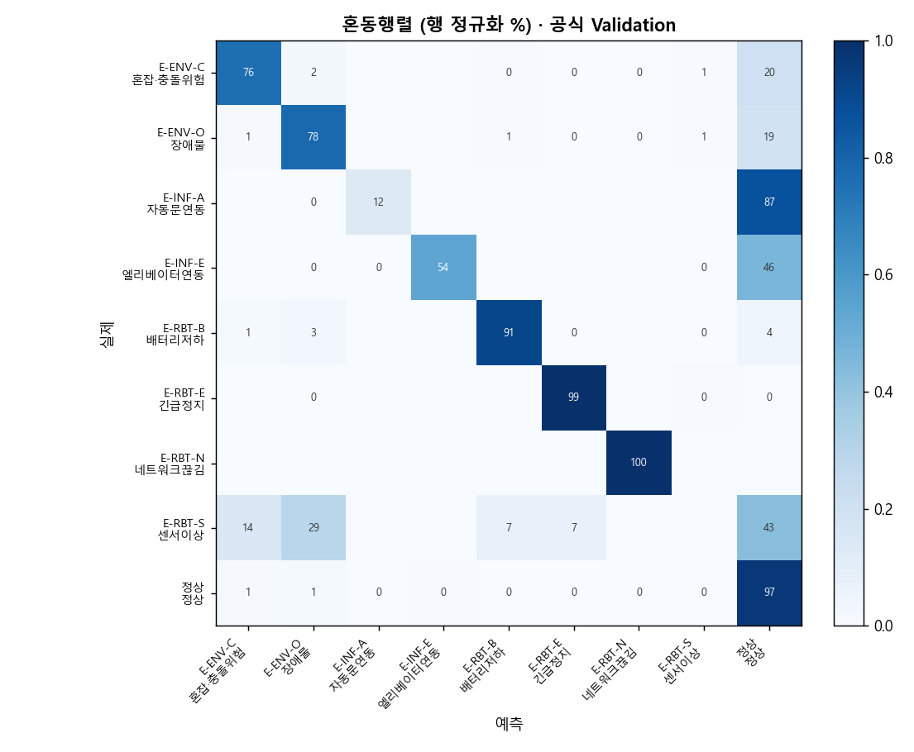
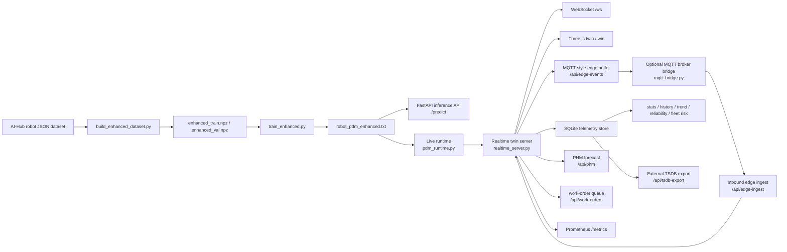

# ServiceRobot_AI

서비스 로봇 및 FAB-style AGV 플릿을 대상으로 한 **실시간 예지보전(Predictive Maintenance) 시스템**입니다.
LightGBM 기반 고장 진단 모델, FastAPI 추론 서버, WebSocket 실시간 스트리밍, Three.js 3D 디지털 트윈, MQTT-compatible 엣지 텔레메트리 계약, 선택형 MQTT broker bridge, SQLite 시계열 저장소, 외부 TSDB export, 신뢰성 지표, 드리프트 모니터링, 정비 작업지시 큐를 하나의 실행 가능한 시스템으로 구성했습니다.

[](https://github.com/JuHyeon-Nam/ServiceRobot_AI/actions/workflows/ci.yml)

## 기술 스택


## 구현 화면

### 시연 허브

`/demo`는 3D 디지털 트윈, 2D 관제 화면, 운영 리포트, 모델 카드, 데이터/AI 운영 지표를 한 화면에서 연결하는 실행형 시연 진입점입니다.

### 3D 디지털 트윈

`/twin`은 3개 층 FAB 구조, AGV 이동, 경고 하이라이트, 설비 선택 패널, 실시간 센서/AI 진단 정보를 Three.js로 시각화합니다.
기본 화면은 천천히 순찰 회전하며, 현재 이상은 빨간색 경고로 자동 포커스하고 예측 이상은 노란색/주황색 PHM 단계로 구분합니다. AGV를 클릭하면 고장 코드, 신뢰도, 센서 추세, AI 판단 근거, 건전도, 정비 권고를 확인할 수 있습니다.



### 2D 관제 화면

실시간 AGV 상태, 경고 피드, KPI, 플릿 현황을 빠르게 확인하기 위한 2D 관제 화면입니다.



### 모델 해석 및 성능 산출물

학습된 LightGBM 모델의 주요 피처와 클래스별 성능을 별도 artifact로 생성합니다.

| Feature importance | Per-class F1 | Confusion matrix |
|---|---|---|
|  |  |  |

## 핵심 기능

| 영역 | 구현 내용 |
|---|---|
| 고장 진단 | 정상 + 8개 고장 코드, 총 9-class 상태 분류 |
| 모델 | LightGBM native model, 249개 engineered feature, CPU 추론 |
| 검증 | Official validation split accuracy `0.9329`, macro-F1 `0.5838` |
| 추론 API | FastAPI `/predict`, `/health`, `/model-card` |
| 실시간 관제 | FastAPI + WebSocket + Three.js 3D twin (`/twin`) |
| 시연 허브 | 주요 화면·운영 API·모델 산출물을 연결하는 데모 진입점 (`/demo`) |
| PHM 예측 | 진단 추세, 건전도, 센서 임계 신호 기반 위험도/RUL 추정 (`/api/phm`) |
| 엣지 텔레메트리 | MQTT-compatible topic/payload contract, optional broker publisher, inbound edge ingest (`/api/edge-contract`, `/api/edge-events`, `/api/edge-ingest`, `mqtt_bridge.py`) |
| 시계열 저장 | SQLite 이벤트 저장, 이력 조회, rollup, CSV/Influx/Timescale export, retention |
| 신뢰성/리스크 지표 | MTBF, MTTR, availability, floor별 운영 risk 분석 (`/api/reliability`, `/api/fleet-risk`) |
| AI 운영 | 데이터 QA, 드리프트 감지, 모델 카드, Prometheus metrics |
| 운영 리포트 | fleet/risk/work-order/drift/reliability/model 요약 및 교대 인수인계 Markdown export (`/api/ops-report`, `/api/shift-handover`) |
| 정비 운영 | P1/P2/P3 작업지시, SLA, overdue 지표 (`/api/work-orders`) |
| 배포 | Dockerfile, `docker compose up --build`, durable telemetry volume |

## 시스템 아키텍처



## 모델

30-step 센서 window와 정적/context feature를 사용해 서비스 로봇의 현재 상태를 진단합니다.

| 항목 | 값 |
|---|---|
| 모델 artifact | `data/processed/robot_pdm_enhanced.txt` |
| 형식 | LightGBM native text model |
| 크기 | 4.30 MiB |
| Feature 수 | 249 |
| Official validation accuracy | 0.9329 |
| Official validation macro-F1 | 0.5838 |
| Best iteration | 73 |

### 진단 클래스

- `정상`
- `E-ENV-C`: collision risk
- `E-ENV-O`: obstacle / route obstruction
- `E-INF-A`: automatic door interface fault
- `E-INF-E`: elevator / lift interface fault
- `E-RBT-B`: battery degradation
- `E-RBT-E`: emergency stop
- `E-RBT-N`: network disconnection
- `E-RBT-S`: sensor abnormality

### Feature Contract

입력 window:

- 30 timesteps.
- Raw dynamic sensors: `batteryLevel`, `speed`, `x`, `y`, `degree`, `collision`, `obstacle`.
- Model dynamic sensors: `batteryLevel`, `speed`, `degree`, `collision`, `obstacle`.
- Excluded dynamic sensors: `x`, `y`.
- Static/context features: `isOffline`, `nowCharging`, `emergencyStop`, `batteryUse`,
  `batteryCycleCount`, `distance`, `crowd`, `deviceType`, `mainState`.

Feature engineering:

- retained time-series flatten.
- sensor별 mean, standard deviation, drift feature.
- retained dynamic sensor별 rFFT magnitude 15개.
- static/context feature encoding.

좌표 `x`, `y`는 사이트 좌표계 암기를 줄이기 위해 모델 입력에서 제외하고, 관제/디지털 트윈 시각화 좌표로만 사용합니다.

### 데이터 출처와 실시간 범위

이 데모는 데이터와 AI의 경계를 명확히 공개합니다. 원본 학습 데이터는 **AI-Hub 실내공간 유지관리 서비스 로봇 JSON**이며, 저장소에는 재배포가 어려운 원본 대신 전처리된 replay metadata와 학습된 모델 artifact만 포함합니다.

| 구간 | 현재 구현 | 의미 |
|---|---|---|
| 3D 이동 | 결정론적 trajectory replay, 약 63초에 한 바퀴 | 화면 시연이 매번 재현되고 실제 설비처럼 천천히 이동 |
| 센서 window | replay 상태를 바탕으로 만든 30-step runtime window | 현재는 물리 로봇 센서 스트림이 아닌 제어 가능한 데모 입력 |
| 고장 진단 | 매 snapshot마다 LightGBM Booster 실시간 추론 | 9-class 고장 코드와 신뢰도는 규칙이 아닌 모델 출력 |
| PHM 위험도/RUL | 건전도·추세·센서 신호 기반 heuristic | 현장 고장 시각으로 보정한 RUL 회귀모델로 교체 가능한 인터페이스 |
| 외부 입력 | `POST /api/edge-ingest` -> WebSocket `/ws` -> 3D twin | MQTT-compatible payload를 즉시 반영하며 기본 10초 TTL 적용 |

따라서 현재 화면은 **AI 추론이 포함된 replay 기반 디지털 트윈**입니다. 실제 MQTT broker에서 지속 수신하는 subscriber와 물리 로봇 센서 연결은 다음 확장 단계이며, 지금도 외부 edge payload를 주입하면 해당 AGV의 3D 색상, 클릭 패널, PHM 위험도가 즉시 바뀝니다. 데이터 출처와 적용 범위는 `/api/data-source`와 `/api/model-card`에서도 확인할 수 있습니다.

## Runtime Components

| Component | File | Responsibility |
|---|---|---|
| Dataset builder | `src/build_enhanced_dataset.py` | 원본 JSON을 train/validation array와 replay metadata로 변환 |
| Trainer | `src/train_enhanced.py` | LightGBM 모델 학습 |
| Evaluator | `src/evaluate_enhanced.py` | 저장 모델 성능 재측정 및 평가 artifact 생성 |
| Inference API | `src/app.py` | `/predict`, `/health`, `/model-card` 제공 |
| Runtime feature builder | `src/pdm_runtime.py` | 모델 로드, live feature 생성, 추론 실행 |
| Realtime server | `src/realtime_server.py` | `/twin`, `/ws`, operational API 제공 |
| FAB layout | `src/fab_layout.py` | 층, 장비, 트랙, AGV 경로 정의 |
| Edge gateway | `src/edge_gateway.py` | AGV 상태를 MQTT-compatible telemetry envelope로 변환 |
| MQTT bridge | `src/mqtt_bridge.py` | `/api/snapshot`을 읽어 실제 MQTT broker로 telemetry publish |
| Telemetry store | `src/telemetry_store.py` | warning/low-health 이벤트 저장 및 집계 |
| TSDB export | `src/tsdb_export.py` | SQLite 이벤트를 InfluxDB line protocol / TimescaleDB SQL로 변환 |
| Work-order store | `src/work_order_store.py` | 예측정비 작업지시 생성, 상태, SLA 관리 |
| Data quality monitor | `src/dataset_quality.py` | schema, annotation, QA, ingest metric 계산 |
| Drift monitor | `src/drift_monitor.py` | live telemetry와 기준 운전 profile 비교 |
| Model card builder | `src/model_card.py` | artifact hash, feature contract, metric, limitation 공개 |

## Quick Start

### Docker Compose

```bash
docker compose up --build
```

접속:

- `http://127.0.0.1:8000/demo`
- `http://127.0.0.1:8000/twin`
- `http://127.0.0.1:8000/api/snapshot`
- `http://127.0.0.1:8000/metrics`

Docker Compose는 runtime telemetry를 `telemetry-data` volume에 저장합니다.

```yaml
TELEMETRY_DB: /app/data/runtime/telemetry.db
```

### Local Development

```bash
python -m venv .venv
source .venv/bin/activate
pip install -r requirements.txt

cd src
uvicorn realtime_server:app --reload
```

접속: `http://127.0.0.1:8000/demo`

### Inference API

```bash
cd src
uvicorn app:app --reload
```

예시:

```json
POST /predict
{
  "window": [
    [82.0, 0.7, 12.3, 4.5, 90.0, 0, 0]
  ],
  "context": {
    "deviceType": "안내로봇",
    "mainState": "MOVE",
    "distance": 47000,
    "batteryUse": 29
  }
}
```

실제 요청에서는 `window`가 30 timesteps를 포함해야 합니다. 위 예시는 field order를 보여주기 위한 축약 예시입니다.

## API

### Realtime State

| Endpoint | Description |
|---|---|
| `GET /twin` | Three.js 3D digital twin |
| `GET /` | 2D realtime control dashboard |
| `WS /ws` | Live fleet state stream |
| `GET /api/layout` | FAB floor/equipment/track layout |
| `GET /api/snapshot` | Current AGV state, KPIs, inference metadata, alerts |
| `GET /api/data-source` | Replay, live-model, rule-based PHM, edge-ingest boundaries |
| `GET /api/phm` | AGV별 PHM forecast, risk score, RUL estimate, action |
| `GET /api/phm?agv=AGV-03` | Single AGV PHM forecast |

### Telemetry and Reliability

| Endpoint | Description |
|---|---|
| `GET /api/history?agv=AGV-03&limit=200` | AGV별 최근 이벤트 |
| `GET /api/history?agv=AGV-03&fmt=csv` | AGV별 이벤트 CSV export |
| `GET /api/stats` | level, floor, asset, health 기준 session aggregate |
| `GET /api/trend?bucket=60&n=15` | 시간 bucket rollup |
| `GET /api/tsdb-contract` | External TSDB export contract |
| `GET /api/tsdb-export?fmt=influx` | InfluxDB line protocol export |
| `GET /api/tsdb-export?fmt=timescale` | TimescaleDB schema + insert SQL export |
| `GET /api/reliability` | Fleet MTBF, MTTR, availability, worst assets |
| `GET /api/reliability?agv=AGV-03` | AGV 단위 reliability metrics |
| `GET /api/fleet-risk` | Floor별 운영 risk, bottleneck floor, 우선 대응 asset |
| `GET /api/ops-report` | 운영 요약 report JSON |
| `GET /api/ops-report?fmt=md` | 운영 요약 report Markdown export |
| `GET /api/shift-handover?shift=night` | 교대 인수인계 checklist JSON |
| `GET /api/shift-handover?shift=night&fmt=md` | 교대 인수인계 Markdown export |

### Edge Telemetry

| Endpoint | Description |
|---|---|
| `GET /api/edge-contract` | MQTT-compatible topic and payload schema |
| `GET /api/edge-events?limit=50` | Recent edge telemetry messages |
| `POST /api/edge-ingest` | Validate inbound edge/MQTT payload and apply it to live twin snapshot for a short TTL |

Optional broker publisher:

```bash
# Terminal 1
cd src
uvicorn realtime_server:app --reload

# Terminal 2, repository root: broker 없이 topic/payload publish 계획만 검증
python src/mqtt_bridge.py --once --dry-run

# Terminal 2, repository root: 실제 broker publish
python src/mqtt_bridge.py --host 127.0.0.1 --port 1883
```

`paho-mqtt`가 설치되어 있어야 실제 broker publish가 동작합니다. `--dry-run`은 broker와 추가 의존성 없이 snapshot을 MQTT publish 이벤트로 변환해 검증합니다.

Inbound replay injection:

```bash
curl -X POST http://127.0.0.1:8000/api/edge-ingest \
  -H "Content-Type: application/json" \
  -d '{"schema":"fab.edge.telemetry.v1","ts":0,"site":"demo-fab","line":"service-robot-ai","asset_id":"AGV-01","floor":0,"position":{"x":120,"y":80,"heading_deg":90},"sensors":{"vib":9.9,"batt":41.0,"temp":66.0},"diagnosis":{"status":"warn","fault":"E-RBT-S","label":"센서 이상","confidence":0.96,"level":"위험","trend":"악화"},"health":{"index":22,"advice":"정비 필요 · 우선 대응"},"source":{"inference_mode":"mqtt_ingest","latency_ms":0,"replay_fault":"E-RBT-S"}}'
```

수신된 payload는 기본 10초 동안 `/api/snapshot`과 `/twin` 클릭 패널의 `Edge 입력`, 센서값, PHM 위험도에 반영됩니다.

Topic pattern:

```text
factory/demo-fab/floor/{floor}/agv/{agv_id}/telemetry
```

Payload groups:

- `position`: x/y coordinate and heading.
- `sensors`: vibration, battery, temperature.
- `diagnosis`: status, fault code, label, confidence, severity level, trend.
- `health`: health index, PHM forecast, and maintenance advice.
- `source`: inference mode, latency, replay audit field.

### AI Operations

| Endpoint | Description |
|---|---|
| `GET /api/data-quality` | Schema, annotation, QA, ingest, rework metrics |
| `GET /api/drift` | Live feature drift status and recommendation |
| `GET /api/model-card` | Model metadata from realtime server |
| `GET /model-card` | Model metadata from inference server |
| `GET /metrics` | Prometheus text-format metrics |

### Maintenance Work Orders

| Endpoint | Description |
|---|---|
| `GET /api/work-orders` | Predictive maintenance work-order queue |
| `GET /api/work-orders?status=open&limit=20` | Filtered work-order queue |
| `POST /api/work-orders/{order_id}/status?status=in_progress` | Work-order status update |

지원 상태:

- `open`
- `acknowledged`
- `in_progress`
- `resolved`
- `closed`

SLA:

- `P1`: 30분.
- `P2`: 2시간.
- `P3`: 24시간.

`/api/work-orders`는 `due_ts`, `age_sec`, `time_to_due_sec`, `overdue`를 함께 반환합니다.

## Training and Evaluation

저장된 모델과 replay data만으로 추론 및 realtime demo를 실행할 수 있습니다.
원본 AI-Hub dataset은 repository에 포함하지 않으며, dataset 재생성과 재학습 시 별도로 필요합니다.

```bash
cd src
python build_enhanced_dataset.py
python train_enhanced.py
python evaluate_enhanced.py
python build_replay.py
```

Validation split은 학습에 사용하지 않은 robot instance를 기준으로 평가하기 때문에 주요 성능 기준으로 사용합니다.

## Testing

```bash
.venv/bin/python -m pytest tests -q
```

테스트 범위:

- Prediction feature contract and inference API behavior.
- Realtime twin API contracts.
- Live Booster inference fields.
- Telemetry storage, retention, history, rollups, reliability metrics.
- Edge telemetry schema and API contract.
- Work-order creation, SLA, overdue, status transitions.
- Data quality, drift monitoring, model card, documentation metadata, Docker contracts.

## Repository Layout

```text
ServiceRobot_AI/
├── data/processed/
│   ├── robot_pdm_enhanced.txt
│   ├── robot_pdm_enhanced_meta.json
│   ├── enhanced_meta.json
│   └── replay.parquet
├── src/
│   ├── app.py
│   ├── realtime_server.py
│   ├── pdm_runtime.py
│   ├── edge_gateway.py
│   ├── telemetry_store.py
│   ├── work_order_store.py
│   ├── dataset_quality.py
│   ├── drift_monitor.py
│   ├── model_card.py
│   ├── fab_layout.py
│   ├── static/
│   └── archive/
├── tests/
├── assets/
├── docs/
├── Dockerfile
├── docker-compose.yml
├── requirements.txt
├── requirements-server.txt
└── README.md
```

## Design Notes

- LightGBM native text model을 사용해 pickle 기반 model loading을 피하고 CPU-only serving을 단순화했습니다.
- `x`, `y` 좌표는 모델 feature에서 제외하고 디지털 트윈 시각화에만 사용합니다.
- Realtime twin은 합성된 30-step window를 live LightGBM inference 경로로 통과시킵니다.
- SQLite는 local demo와 compact deployment를 위한 기본 저장소입니다.
- MQTT-compatible edge telemetry contract는 실제 broker 및 외부 time-series DB로 확장하기 위한 경계입니다.
- `/api/tsdb-export`는 SQLite 이벤트를 InfluxDB line protocol 또는 TimescaleDB SQL로 변환해 외부 TSDB 적재 경로를 검증합니다.
- Prometheus metrics는 fleet 상태, 운영 risk score, inference latency, edge ingest, drift, reliability, telemetry volume, work-order SLA를 노출합니다.

## Limitations

- Live digital twin은 replay trajectory와 deterministic sensor-window synthesis를 사용합니다.
- Rare fault class는 validation support가 낮아 aggregate accuracy보다 per-class reliability가 약합니다.
- SQLite는 compact runtime에는 적합하지만 고빈도 telemetry production workload에는 broker + time-series DB가 필요합니다. 현재는 InfluxDB/TimescaleDB export 계약까지 제공합니다.
- 3D twin은 operational simulation이며 실제 공장 layout calibration을 거친 모델은 아닙니다.
