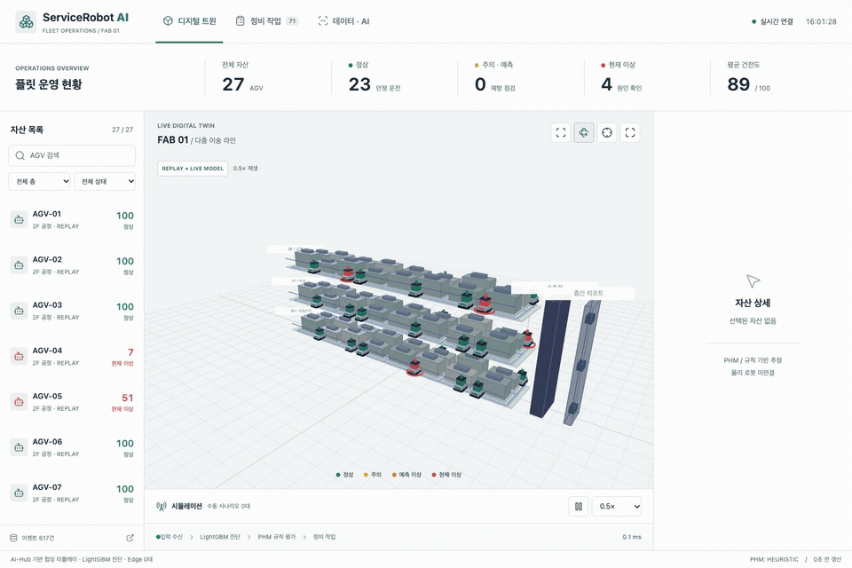
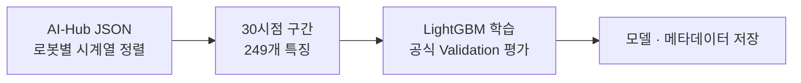
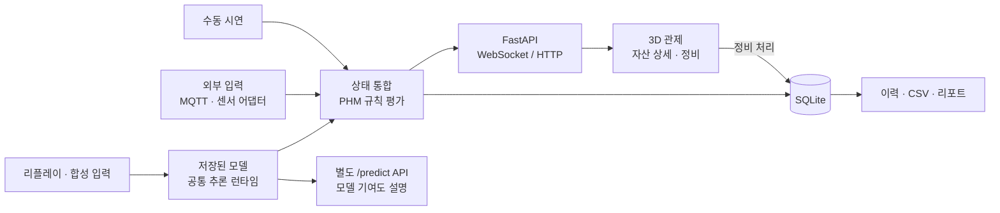

# ServiceRobot_AI

**고장 진단 · 3D 디지털 트윈 · 정비 관리**

AI-Hub 서비스 로봇 데이터를 활용한 상태진단 시스템. LightGBM 고장 분류와 규칙 기반 PHM 평가를 3D 관제·정비 작업에 연결.

[](https://github.com/JuHyeon-Nam/ServiceRobot_AI/actions/workflows/ci.yml)

[3D 관제](#3d-관제) · [주요 기능](#주요-기능) · [기술 스택](#기술-스택) · [파이프라인](#파이프라인) · [모델 성능](#모델-성능) · [실행](#실행) · [상세 설명](docs/PORTFOLIO_WALKTHROUGH.md)

## 3D 관제

[](assets/twin_walkthrough.mp4)

[시연 영상 · 38초](assets/twin_walkthrough.mp4) · [시연 가이드](docs/DEMO_CAPTURE_CHECKLIST.md)

<details>
<summary>상태 전환 시연 · 정상 → 주의 → 예측 이상 → 현재 이상</summary>



최신 관제 화면의 실제 브라우저 녹화에서 추출한 20초 구간. 수동 시나리오로 상태 전환과 자산 상세 동작 재현.

</details>

**자산 선택 → 센서·진단 확인 → 위험 평가 → 정비 처리 → 이력 조회**

3층 가상 FAB와 27대 AGV 관제. 정상 자산도 선택·확대 가능. 선택 층 집중, 주변 설비 반투명 처리, 느린 카메라 순찰 적용.

| 초록 · 정상 | 노랑 · 주의 | 주황 · 예측 이상 | 빨강 · 현재 이상 |
|:---:|:---:|:---:|:---:|
| 위험 점수 30 미만 | 위험 점수 30~54 | 위험 점수 55 이상 | 현재 고장 진단 |

노랑·주황은 현재 고장 진단이 없는 자산에 적용하는 PHM 점검 단계. 미래 고장 확률을 의미하지 않음.

## 주요 기능

| 기능 | 구현 내용 |
|---|---|
| 자산 관제 | 검색·층/상태 필터, 정상/이상 자산 선택, 확대·홈 복귀·전체 화면 구현. |
| 주행 제어 | 시간 기준 경로 이동, 0.25× / 0.5× / 1×, 주행 일시정지 지원. 기본 0.5×에서 약 125초 주기. |
| 고장 진단 | 30시점 센서 구간에서 정상 및 8개 고장 분류. 자산별 진단·모델 신뢰도·추론 시간 제공. |
| PHM 평가 | 건전도·진단 추세·센서 임계 신호를 조합한 위험 점수와 점검 권고 구현. |
| 정비 작업 | 접수 → 점검 → 조치 완료 → 종결. 동일 고장 중복 억제, 정상 복귀 후 재발 시 신규 작업 생성. |
| 이력·리포트 | SQLite 이벤트 저장, 자산별 이력·CSV·추세·운영/인수인계 리포트 제공. |
| 데이터·AI | 입력 출처, 데이터 품질, 분포 변화, 모델 카드와 검증 지표 조회. |
| 연결·화면 | WebSocket 재접속·HTTP 폴링 대체, 갱신 경과 표시, 데스크톱·태블릿·모바일 대응. |

## 기술 스택

| 영역 | 기술 | 용도 |
|---|---|---|
| 데이터 |    | JSON 파싱·센서 구간 생성·특징 추출 |
| 모델 |   | 고장 분류·평가·오프라인 RUL 회귀 |
| 서버 |   | REST API·WebSocket·입력 검증 |
| 관제 |     | 3D 렌더링·자산 상세·반응형 UI |
| 저장·연결 |   | 이벤트·정비 저장, 외부 텔레메트리 연동 |
| 실행·검증 |     | 컨테이너 구성·CI·API/브라우저 검증 |

Three.js·OrbitControls·Lucide는 로컬 자산으로 제공. Python 의존성은 `requirements*.txt`, 브라우저 검증 의존성은 `package-lock.json`에 고정.

## 파이프라인

**학습**


```mermaid
flowchart LR
    A["AI-Hub JSON<br/>로봇별 시계열 정렬"] --> B["30시점 구간<br/>249개 특징"]
    B --> C["LightGBM 학습<br/>공식 Validation 평가"]
    C --> D["모델 · 메타데이터 저장"]
```

**운영**


```mermaid
flowchart LR
    A["리플레이 · 합성 입력"] --> B["저장된 모델<br/>공통 추론 런타임"]
    B --> C["상태 통합<br/>PHM 규칙 평가"]
    D["외부 입력<br/>MQTT · 센서 어댑터"] --> C
    E["수동 시연"] --> C
    C --> F["FastAPI<br/>WebSocket / HTTP"]
    F --> G["3D 관제<br/>자산 상세 · 정비"]
    C --> H[("SQLite")]
    G -->|"정비 처리"| H
    H --> I["이력 · CSV · 리포트"]
    B --> J["별도 /predict API<br/>모델 기여도 설명"]
```

추론 API와 관제 서버는 `pdm_runtime.py`의 특징 생성·모델 로딩 로직 공유. 외부 입력은 보고된 센서·진단을 반영하며, 수동 시연 상태와 함께 출처를 별도 기록.

## 모델 성능

| 항목 | 결과 |
|---|---|
| 데이터 | AI-Hub 실내공간 유지관리 서비스 로봇 데이터 |
| 과제 | 정상 + 8개 고장, 9-class 분류 |
| 평가 | AI-Hub 공식 Validation split |
| Accuracy | **93.29%** |
| Macro-F1 | **0.5838** |
| 정상 단일 예측 기준선 | Accuracy 약 83% |
| 모델 | LightGBM native Booster · 4.30 MiB · best iteration 73 |

저장된 [모델 메타데이터](data/processed/robot_pdm_enhanced_meta.json) 기준. 정상 비중이 높아 Accuracy와 Macro-F1 병기. 통신·센서 이상 등 희소 클래스의 검증 표본 부족은 추가 평가 과제.

### 입력 및 특징

| 구성 | 내용 | 차원 |
|---|---|---:|
| 동적 센서 | 배터리 잔량·속도·방향각·충돌·장애물, 30시점 | 150 |
| 통계·변화량 | 센서별 평균·표준편차·앞뒤 구간 평균 차이 | 15 |
| 주파수 | 센서별 rFFT magnitude 15개 | 75 |
| 상태·맥락 | 오프라인·충전·비상정지·배터리 사용/사이클·누적 거리·혼잡도·장치 유형·운전 상태 | 9 |
| **합계** | | **249** |

절대좌표 `x`, `y`는 시각화에만 사용. 장소별 좌표 암기 위험을 줄이기 위해 모델 입력에서 제외. 30시점의 실제 시간 길이는 샘플링 주기에 따라 결정.

<details>
<summary>진단 코드 · 9개 상태</summary>

| 코드 | 상태 |
|---|---|
| `정상` | 정상 운전 |
| `E-ENV-C` | 충돌 위험 |
| `E-ENV-O` | 장애물·경로 방해 |
| `E-INF-A` | 자동문 인터페이스 이상 |
| `E-INF-E` | 엘리베이터 인터페이스 이상 |
| `E-RBT-B` | 배터리 이상 |
| `E-RBT-E` | 비상정지 |
| `E-RBT-N` | 네트워크 이상 |
| `E-RBT-S` | 센서 이상 |

</details>

[모델 카드](docs/MODEL_CARD.md) · [클래스별 F1](assets/per_class_f1.png) · [Confusion matrix](assets/confusion_matrix.png) · [특징 중요도](assets/feature_importance.png)

## 설계 및 검증 범위

| 설계 항목 | 적용 내용 |
|---|---|
| 입력 일관성 | 추론 API·관제 공통 런타임, 249개 특징 계약 검증. |
| 데이터 추적 | `replay_model` / `demo_scenario` / `edge_ingest` 출처 저장. MQTT 전달·CSV·TSDB export에도 출처 유지. |
| 정비 사건 관리 | 동일 고장 작업 중복 억제, 정상 복귀 후 재발 구분. SQLite에 사건 상태 저장. |
| RUL 평가 | 자산 단위 holdout, 중앙값 기준선 비교, 독립 고장 사건 집계. 수동 시연 데이터 제외. |
| 연결 복구 | WebSocket 재접속과 HTTP 폴링 대체. 마지막 데이터 갱신 경과 표시. |
| 화면 검증 | 실제 WebGL 픽셀·프레임 변화, 자산 클릭, 상태 전환, 정비 작업, 반응형 검사. |

| 구분 | 현재 범위 |
|---|---|
| 고장 진단 | 공개 서비스 로봇 데이터로 학습한 LightGBM 분류 모델. |
| 기본 시연 | 합성 센서 구간·리플레이에 모델 추론 적용. 물리 로봇 기본 미연결. |
| 수동 시나리오 | 상태를 강제해 화면·정비 흐름 재현. 모델 신뢰도 표시 제외. |
| 외부 입력 | 센서·위치·보고 진단 반영. 어댑터의 기본 진단은 임계값 규칙 사용. |
| PHM·RUL | 운영 화면은 건전도·추세·센서 기반 규칙. RUL 데이터 생성·회귀 학습은 오프라인 파이프라인으로 제공. |
| 3D·운영 지표 | 가상 FAB 시각화와 시뮬레이션 관측 지표. 실제 속도·물리 모델·생산 KPI 보정은 후속 검증 범위. |

기본 화면의 진동·온도는 관제용 합성 신호이며 LightGBM 동적 입력에 포함되지 않음. 3D 점검 근거는 코드별 점검 항목, `/predict` 설명은 모델 기여도 기반. 현장 PHM 적용에는 실제 고장 시각 라벨·장비·MQTT 통합 검증 필요.

## 실행

Python 3.11 기준. 저장된 모델과 리플레이로 관제 실행 가능. 원본 데이터 재처리는 별도 AI-Hub 데이터와 경로 설정 필요.

### 로컬 관제

저장소 루트에서 실행.

```bash
python -m venv .venv
source .venv/bin/activate
pip install -r requirements-server.txt
uvicorn realtime_server:app --app-dir src --reload --port 8000
```

Windows 가상환경 활성화: `.venv\Scripts\activate`.

| 화면 | 주소 |
|---|---|
| 통합 3D 관제 | [localhost:8000/twin](http://127.0.0.1:8000/twin) |
| 관제 API 문서 | [localhost:8000/docs](http://127.0.0.1:8000/docs) |

`/demo`는 `/twin`과 동일한 화면. 시연 설정은 같은 서버에 접속한 화면에서 공유.

### 별도 추론 API

새 터미널에서 가상환경 활성화 후 실행.

```bash
cd src
uvicorn app:app --reload --port 8001
```

[`localhost:8001/docs`](http://127.0.0.1:8001/docs)에서 30×7 센서 구간과 context를 입력해 `/predict` 호출. 내부 모델 특징 생성 시 `x`, `y` 제외.

### Docker Compose

```bash
docker compose up --build
```

관제 포트 `8000`, SQLite 영구 볼륨 `telemetry-data`. 선택형 MQTT smoke 환경:

```bash
docker compose --profile mqtt-smoke up --build
```

## API

관제 서버 `:8000`과 추론 서버 `:8001`로 구분.

| 서버 | 경로 | 기능 |
|---|---|---|
| 추론 | `POST /predict` | 센서 구간 고장 분류·모델 기여도 설명 |
| 관제 | `WS /ws`, `GET /api/snapshot` | 플릿 상태 스트림·현재 상태 조회 |
| 관제 | `GET/POST /api/demo` | 자산별 시연 상태·재생 제어 |
| 관제 | `POST /api/edge-ingest` | 외부 텔레메트리 입력 |
| 관제 | `GET /api/history`, `GET /api/trend` | 자산 이력·시간 구간 집계 |
| 관제 | `GET /api/work-orders` | 정비 작업 조회 |
| 관제 | `POST /api/work-orders/{id}/status` | 정비 작업 상태 변경 |
| 관제 | `GET /api/data-quality`, `GET /api/drift` | 데이터 품질·분포 변화 조회 |
| 관제 | `GET /api/model-card`, `GET /api/data-source` | 모델 정보·데이터 출처 조회 |
| 관제 | `GET /api/rul-contract` | RUL 계약·데이터 준비도·오프라인 모델 메타데이터 |
| 관제 | `GET /api/shift-handover?fmt=md` | 인수인계 리포트 |
| 관제 | `GET /metrics` | Prometheus 운영 지표 |

## 테스트

**검증 기록: 2026-10-02 · Python 104개 통과 · 브라우저 6개 화면 크기 검증.**

```bash
pip install -r requirements.txt
python -m pytest tests -q
```

Node.js 20 이상. 별도 관제 서버 실행 후 브라우저 검증:

```bash
npm ci
npx playwright install chromium
CHROME_CHANNEL=chromium TWIN_URL=http://127.0.0.1:8000 npm run test:ui
```

360~1920px 화면에서 렌더링·클릭·움직임·4단계 상태·정비 처리·WebSocket 차단 시 폴링 복구 확인. 시연 설정은 복원하나 정비 이력은 남으므로 별도 테스트 서버 권장.

GitHub Actions에 Python 테스트·Docker smoke 작업 구성. 브라우저 검증은 로컬 수행, [CI 확장 예제](docs/ci-workflow-with-browser.example.yml) 제공. 최신 UI 변경의 로컬 Docker 실행은 별도 재검증 필요.

## 코드 구성

| 경로 | 역할 |
|---|---|
| `src/build_enhanced_dataset.py` | 원본 JSON·30시점 구간 생성 |
| `src/train_enhanced.py`, `src/evaluate_enhanced.py` | LightGBM 학습·공식 Validation 평가 |
| `src/pdm_runtime.py`, `src/app.py` | 공통 추론 런타임·추론 API |
| `src/realtime_server.py`, `src/demo_runtime.py` | 상태 스트림·PHM·시연 제어 |
| `src/static/twin*`, `src/fab_layout.py` | 3D 관제·자산 상세·레이아웃 |
| `src/telemetry_store.py`, `src/work_order_store.py` | 이벤트·정비 사건 저장 |
| `src/edge_gateway.py`, `src/physical_sensor_adapter.py`, `src/mqtt_*.py` | 외부 입력·센서 어댑터·MQTT |
| `src/build_rul_dataset.py`, `src/train_rul_baseline.py`, `src/rul_runtime.py` | RUL 데이터·오프라인 학습·계약 |
| `scripts/verify_twin.mjs`, `scripts/capture_demo.mjs` | 브라우저 검증·시연 캡처 |

## 문서

[프로젝트 상세 설명](docs/PORTFOLIO_WALKTHROUGH.md) · [구현 현황·다음 과제](docs/PROJECT_STATUS.md) · [모델 카드](docs/MODEL_CARD.md) · [시연 가이드](docs/DEMO_CAPTURE_CHECKLIST.md)

Maintainer: [JuHyeon-Nam](https://github.com/JuHyeon-Nam)
