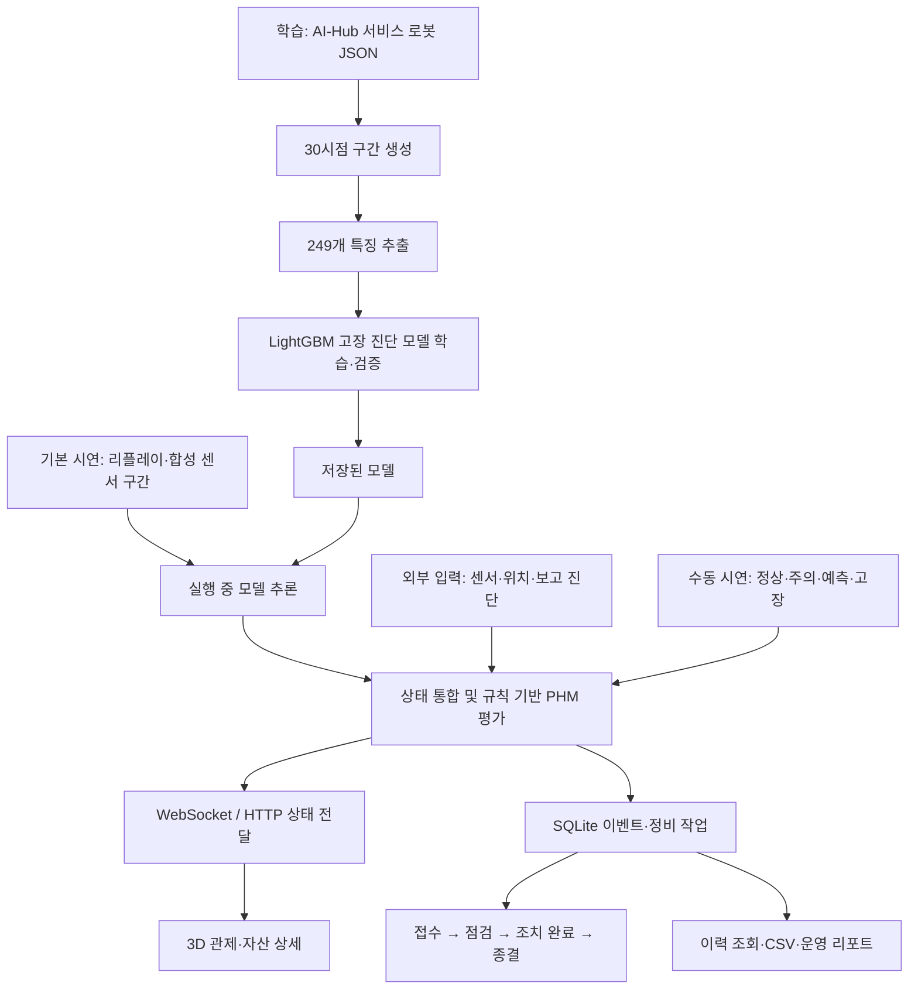
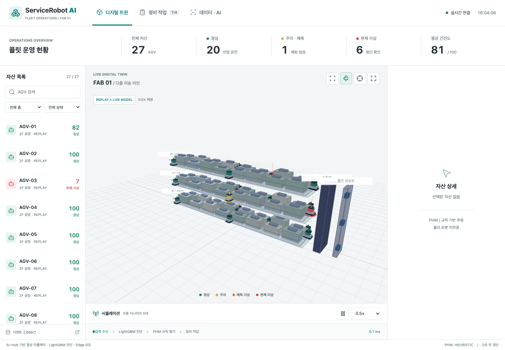

# ServiceRobot_AI 프로젝트 설명 및 시연 가이드

정리 기준일: 2026-10-05. 코드·모델 메타데이터·기존 검증 기록을 기준으로 작성했습니다.
최신 기능 업그레이드는 `b5593e4`이며, 아래 테스트 수치는 2026-10-02 검증 기록입니다.

## 1. 어떤 프로젝트인가

**서비스 로봇·AGV의 센서 데이터를 이용해 고장 상태를 진단하고, 3D 공간에서 위험 자산을 확인한 뒤 정비 작업과 이력 관리로 연결하는 디지털 트윈 기반 PHM 관제 시스템입니다.**

쉽게 말하면, 여러 로봇을 운용하는 관리자가 다음 질문에 한 화면에서 답할 수 있도록 만든 프로젝트입니다.

- 지금 어떤 로봇이 정상이고 어떤 로봇에 문제가 있는가?
- 그 로봇은 어느 층, 어느 위치에 있는가?
- 어떤 고장으로 진단됐고 어떤 신호를 확인해야 하는가?
- 아직 고장으로 진단되지는 않았지만 점검해야 할 징후가 있는가?
- 무엇부터 정비해야 하고 작업은 어디까지 처리됐는가?
- 이전 상태와 정비 기록은 어떻게 남아 있는가?

AGV는 물류 운반 등에 사용하는 무인 운반차입니다. PHM은 자산의 상태를 평가하고 고장 징후를 파악해 정비를 돕는 기술을 뜻합니다. 현재 화면은 FAB를 모티브로 한 3층 가상 공간에서 AGV를 관제합니다. AI-Hub 서비스 로봇 데이터로 학습한 모델을 이 공간에 연결했으며, 실제 반도체 제조 설비의 고장을 검증한 모델이라는 의미는 아닙니다.

## 2. 남에게 바로 설명하는 문장

### 30초 설명

> 서비스 로봇의 센서 데이터를 분석해 정상과 8가지 고장을 구분하는 AI 모델을 만들고, 결과를 3D 관제 화면에 연결한 프로젝트입니다. 정상은 초록, 주의는 노랑, 예측 이상은 주황, 현재 고장은 빨강으로 표시합니다. 로봇을 클릭하면 상태와 점검 항목을 확인하고 정비 작업을 처리할 수 있습니다. 현재는 공개 데이터로 학습한 모델과 시뮬레이션을 결합한 시스템이며, 실제 장비 연결과 학습형 잔여수명 예측을 다음 단계로 준비했습니다.

### 1분 설명

> 이 프로젝트는 로봇 고장 진단 결과를 실제 관리자가 사용할 수 있는 관제 흐름으로 연결하는 데 초점을 맞췄습니다. AI-Hub의 서비스 로봇 센서 데이터를 30시점 구간으로 묶고, 통계와 변화량, 주파수 특징을 추출해 LightGBM으로 정상 및 8가지 고장을 분류합니다. 저장된 공식 검증 결과는 정확도 93.29%, Macro-F1 58.38%이며, 드문 고장의 성능 한계도 함께 공개합니다.
>
> 진단 결과는 FastAPI와 WebSocket을 통해 Three.js 화면으로 전달됩니다. 사용자는 정상 로봇도 선택해 확대할 수 있고, 상태·센서·건전도·점검 권고를 확인한 뒤 정비 접수부터 종결까지 처리합니다. 데이터 출처와 작업 이력도 저장합니다. 현재 PHM 위험도는 규칙 기반이고, 실제 고장 시각을 이용한 RUL 학습·평가 파이프라인은 별도로 마련했습니다.

## 3. 전체 동작 흐름

학습 단계와 실행 단계가 구분됩니다. 학습에는 공개 로봇 데이터가 사용됐고, 기본 실행 화면에서는 재현 가능한 합성 센서 구간을 모델에 넣습니다. 외부 입력과 수동 시연은 자신의 출처를 유지한 채 화면 상태에 반영됩니다.

## 4. 이번에 무엇을 업그레이드했나

| 영역 | 이번 업그레이드 | 사용자가 느끼는 변화 |
|---|---|---|
| 화면 구성 | 디지털 트윈·정비 작업·데이터/AI를 통합 | 자산 확인에서 정비 처리와 모델 근거 확인까지 같은 화면에서 이동 |
| 가독성 | 밝은 배경, 정보 위계, 상태 색상, 로컬 아이콘 | 어두운 장면과 작은 정보 때문에 상태를 놓치는 문제 개선 |
| 자산 탐색 | 검색, 층·상태 필터, 목록 정렬 안정화 | 찾고 싶은 AGV를 빠르게 선택 |
| 3D 이동 | 경로 진행을 시간 기준으로 계산, 기본 0.5배속 | 일정하고 느린 주행 |
| 카메라 | 정상 AGV도 선택·확대, 선택한 층에 집중 | 정상·이상 로봇 모두 자세히 확인 |
| 시야 | 다른 층 숨김, 주변 설비 반투명, 선택 강조 | 로봇이 건물·설비에 가려지는 현상 완화 |
| 조작 | 느린 자동 순찰, 홈, 위험 자산 선택, 전체 화면, 주행 일시정지 | 전체 상황 확인과 특정 자산 점검을 오갈 수 있음 |
| 시연 | 정상·주의·예측 이상·배터리 이상·통신 이상 제어 | 발표 중 원하는 단계의 변화 재현 |
| 정비 | 접수·점검·완료·종결, 동일 고장 중복 작업 억제 | 같은 신호가 계속 들어와도 완료 작업을 반복 생성하지 않음 |
| 재발 처리 | 정상 복귀 뒤 동일 고장 재발 시 새 작업 생성 | 이전 고장과 새로운 고장 사건 구분 |
| 데이터 출처 | 모델 시연·수동 시나리오·외부 입력 출처 저장 | 각 상태가 어떻게 만들어졌는지 확인 |
| 연결 복구 | WebSocket 재접속, 실패 시 HTTP 폴링, 갱신 경과 표시 | 연결 상태와 데이터가 오래됐는지 확인 |
| RUL 평가 | 자산 단위 학습/평가 분리, 독립 고장 사건 집계 | 같은 로봇 데이터를 학습·평가에 섞는 문제 방지 |
| 학습 데이터 관리 | 수동 시나리오 기록을 RUL 데이터 생성에서 제외 | 전시용으로 강제한 상태가 학습 근거에 섞이는 문제 방지 |
| 검증·기록 | 브라우저 자동 검증, 최신 화면과 38초 영상 | 화면 동작을 재현하고 결과를 눈으로 확인 |

기존 LightGBM 고장 진단 모델을 이번 UI 업그레이드에서 재학습하지는 않았습니다. 이번 변화의 중심은 관제 사용성, 정비 처리, 입력 출처 관리, RUL 평가 방식입니다.

## 5. 데이터는 어디서 오는가

| 구분 | 출처와 사용 방식 | 설명할 때 강조할 점 |
|---|---|---|
| 진단 모델 학습 | AI-Hub 실내공간 유지관리 서비스 로봇 JSON | 공개 데이터에 기반한 학습형 고장 분류 |
| 기본 화면 `replay_model` | 리플레이와 결정론적 합성 센서 구간 | 캐시되지 않은 구간에서 저장된 LightGBM 모델 추론 수행 |
| 수동 화면 `demo_scenario` | 발표자가 선택한 고정 시나리오 | 상태를 강제해 UI·정비 흐름을 재현하며 모델 신뢰도를 표시하지 않음 |
| 외부 입력 `edge_ingest` | API, MQTT subscriber, 센서 어댑터 경로 | 외부에서 전달한 센서·위치·진단을 화면에 반영; 실제 장비 검증은 추가 필요 |

현재 기본 시연은 AI-Hub 서버에서 데이터를 계속 받아 오는 구조가 아닙니다. 실시간이라는 말은 실행 중 서버가 상태를 갱신하고 브라우저에 전달한다는 뜻입니다. 물리 로봇의 실시간 센서가 기본 연결돼 있다는 뜻은 아닙니다.

외부 입력이 유효한 동안 해당 자산은 외부 입력을 우선 반영합니다. 물리 센서 어댑터는 JSON/CSV 입력을 표준 payload로 변환하며, 진단이 없는 입력에 대해 간단한 임계값 규칙으로 진단을 채울 수 있습니다. 이 경로의 진단을 LightGBM 검증 결과로 설명해서는 안 됩니다.

## 6. AI가 실제로 하는 일

### 고장 분류

모델은 센서값 하나만 보고 판단하는 대신, 연속된 **30개 시점**의 정보를 묶어서 입력받습니다. 30시점은 30초를 뜻하지 않으며, 실제 시간 길이는 데이터의 샘플링 주기에 따라 달라집니다.

| 항목 | 내용 |
|---|---|
| 동적 센서 5종 | 배터리 잔량, 속도, 방향각, 충돌, 장애물 |
| 상태·누적 정보 9종 | 오프라인 여부, 충전 여부, 비상정지, 배터리 사용량, 배터리 사이클 수, 누적 거리, 혼잡도, 장치 유형, 운전 상태 |
| 시계열 원값 | 30시점 × 5센서 = 150개 |
| 통계·변화 특징 | 센서별 평균·표준편차·앞뒤 구간 변화량 = 15개 |
| 주파수 특징 | 센서별 rFFT 크기 15개씩 = 75개 |
| 총 입력 | 150 + 15 + 75 + 9 = 249개 |

평균은 전반적인 수준, 표준편차는 변동, 앞뒤 구간 변화량은 증가·감소, 주파수 특징은 반복적인 변화를 표현합니다. 여러 관점의 정보를 함께 넣어 고장 분류에 사용합니다.

절대 위치 `x`, `y`는 시각화에 보존하지만 모델 입력에서는 제외합니다. 특정 장소 좌표를 외우는 방식으로 고장을 판단할 위험을 줄이기 위한 선택입니다. 학습과 추론은 공통 특징 생성 코드를 사용해 입력 순서와 차원을 맞춥니다.

### 분류하는 상태

| 코드 | 상태 |
|---|---|
| `normal` / `정상` | 정상 |
| `E-ENV-C` | 충돌 위험 |
| `E-ENV-O` | 장애물·경로 방해 |
| `E-INF-A` | 자동문 인터페이스 이상 |
| `E-INF-E` | 엘리베이터 인터페이스 이상 |
| `E-RBT-B` | 배터리 이상 |
| `E-RBT-E` | 비상정지 |
| `E-RBT-N` | 네트워크 이상 |
| `E-RBT-S` | 센서 이상 |

### 모델 선택과 성능

LightGBM은 특징으로 정리한 표 형태의 입력을 분류하는 모델입니다. 현재 구현에서는 저장된 약 4.30 MiB 모델을 CPU에서 실행하고, 자산별 추론 시간을 노출합니다. 다른 모델보다 우월하다는 비교 실험 결과나 고정 지연시간을 주장하는 것은 아닙니다.

| 저장된 공식 검증 지표 | 값 | 해석 |
|---|---|---|
| 정확도 | 93.29% | 전체 평가 구간 중 맞춘 비율 |
| Macro-F1 | 58.38% | 각 클래스의 F1을 같은 비중으로 평균한 값 |
| 정상만 예측하는 기준선 정확도 | 약 83% | 정상 데이터가 많으므로 높은 정확도만으로 충분하지 않음 |
| 모델 입력 특징 수 | 249개 | 학습·추론 공통 계약 |
| 최적 학습 iteration | 73 | 저장된 모델 메타데이터 값 |

프로젝트 기록은 공식 검증 split을 학습에 사용하지 않은 로봇 인스턴스에 대한 평가로 설명합니다. 이 문서 작성 과정에서는 원본 데이터 전체로 모델을 다시 학습하거나 해당 분할을 재감사하지 않았습니다. 특히 통신·센서 이상 등 희소 클래스는 검증 표본이 적어 추가 평가가 필요합니다.

발표에서는 **“정확도 93.29%를 얻었으며, 클래스 불균형을 고려한 Macro-F1은 58.38%여서 희소 고장 개선이 남아 있다”**고 두 지표를 함께 말하면 됩니다. 분류 모델의 신뢰도는 보정된 미래 고장 확률이나 실제 고장 확정률과도 구분해야 합니다.

## 7. PHM·색상·잔여수명은 어떻게 동작하는가

고장 진단은 지금의 상태를 분류하는 기능입니다. PHM 위험 평가는 건전도, 최근 추세, 센서 임계 신호를 종합해 점검 우선순위를 정합니다.

| 색상 | 화면 상태 | 현재 계산 의미 |
|---|---|---|
| 초록 | 정상 | 현재 이상이 없고 위험 점수 30 미만 |
| 노랑 | 주의 | 현재 이상이 없고 위험 점수 30 이상·55 미만 |
| 주황 | 예측 이상 | 현재 이상이 없고 위험 점수 55 이상 |
| 빨강 | 현재 이상 | 현재 진단이 이상 상태 |

위험 점수는 건전도 저하, 추세 악화, 진동 상승·배터리 저하·온도 상승 같은 신호를 규칙으로 더해 0~100 범위로 계산합니다. **주황색은 학습된 모델이 미래 고장 확률을 산출했다는 뜻이 아니라, 현재 구현의 조기 점검 조건에 도달했다는 뜻입니다.**

화면의 진동·온도는 기본 시연에서 생성한 관제용 신호이고, 위 LightGBM의 5종 동적 입력에는 포함되지 않습니다. 모델 진단과 PHM 보조 신호를 구분해서 설명해야 합니다.

현재 API의 RUL 추정값은 상태별 고정 값인 주의 120분, 예측 이상 45분, 현재 이상 0분 등을 사용합니다. 실제 고장까지 남은 시간을 측정하거나 검증한 결과가 아닙니다. 운영 화면에서는 점검 권고 수준으로 해석해야 합니다.

학습형 RUL을 위한 준비도 함께 구현했습니다.

1. 센서 이력과 실제 고장 시각 라벨을 연결해 학습 테이블을 만드는 코드가 있습니다.
2. 관측된 고장 행으로 GradientBoosting 회귀 모델을 학습하고 중앙값 기준선과 비교합니다.
3. 학습 자산과 평가 자산을 분리하고 자산이 하나뿐이면 holdout 평가를 거부합니다.
4. 고장 한 번에서 생성한 여러 행을 여러 독립 고장으로 세지 않습니다.
5. 수동 시연 출처는 데이터 생성에서 제외하며, 오프라인 모델 메타데이터가 있어도 운영 PHM을 자동 교체하지 않습니다.

이 파이프라인은 합성 fixture로 동작을 검증했습니다. 실제 데이터에서 RUL 성능을 입증하는 작업과, 고장이 관측되지 않은 구간을 다루는 survival 모델은 후속 개발 범위입니다.

## 8. 3D 화면에서 실제로 보여줄 수 있는 것

- 3층 가상 FAB와 움직이는 AGV, 상태별 색상과 경고 강조.
- 정상 AGV를 포함한 목록·3D 클릭 선택과 자산 확대.
- 선택 층에 집중하는 카메라, 주변 설비 반투명 처리, 선택 표시.
- 검색, 층·상태 필터, 정상·주의·예측·현재 이상 자산 요약.
- 센서 표시, 최근 이력 그래프, 건전도, 위험 점수, 점검 권고.
- 느린 카메라 순찰, 홈 복귀, 위험 자산 선택, 전체 화면.
- 0.25배·0.5배·1배 재생과 주행 일시정지.
- 정비 작업 처리와 데이터/AI 근거 화면.

기본 0.5배속은 약 125초에 한 바퀴입니다. 실제 AGV의 m/s, 가속도, 충돌 회피를 검증한 물리 시뮬레이터는 아닙니다. 주행 일시정지는 움직임 제어이며, 데이터 수집 전체를 멈추는 명령도 아닙니다.

3D의 점검 근거는 고장 코드별 점검 항목과 규칙 신호입니다. 별도 `/predict` 추론 API에서는 모델 기여도에 기반한 신호 그룹 설명을 제공합니다. 점검 문구만으로 고장의 물리적 원인을 확정했다고 설명하지 않습니다.

## 9. 정비와 데이터 관리

이 프로젝트는 진단 결과를 다음 행동까지 연결합니다.

**이상 발견 → 정비 작업 후보 생성 → 접수 → 점검 시작 → 조치 완료 → 종결**

작업에는 자산과 고장, 우선순위, 권고, 상태가 연결됩니다. 동일 고장 신호가 계속 들어와도 완료·종결된 작업을 반복 생성하지 않으며, 정상 복귀 후 고장이 다시 발생하면 새로운 사건으로 작업을 만듭니다. 중복 억제 상태는 SQLite에 저장해 재시작 후에도 유지합니다.

텔레메트리 이벤트에는 상태·센서·PHM 값과 입력 출처를 남깁니다. 자산 이력 조회, CSV 내보내기, 시계열 DB용 export, 운영·인수인계 리포트 경로를 제공합니다. 데이터 품질, 분포 변화, 모델 메타데이터, Prometheus 지표 확인 기능도 있습니다.

현재 이력은 이벤트 중심입니다. MTBF·MTTR·가용도·영향도 등은 시뮬레이션 관측 지표이므로 실제 생산라인의 신뢰성·손실 지표로 사용하려면 정상 운전 시간과 실제 고장·정비 라벨을 확보해야 합니다.

## 10. 기술 스택과 역할

| 기술 | 프로젝트에서 하는 일 |
|---|---|
| Python·NumPy·pandas | JSON 처리, 센서 구간 생성, 특징 계산, 평가 |
| LightGBM | 정상·8개 고장 분류, 실행 중 추론 |
| scikit-learn | RUL 오프라인 회귀 학습과 기준선 평가 |
| FastAPI·Pydantic | 추론·관제 API와 입력 계약 검증 |
| WebSocket | 서버의 상태 변경을 브라우저에 전달 |
| Three.js·OrbitControls | 3D 공간·AGV 렌더링과 카메라 조작 |
| HTML·CSS·JavaScript·Lucide | 한국어 통합 UI와 반응형 화면 |
| SQLite | 텔레메트리 이벤트·정비 작업·고장 사건 상태 저장 |
| MQTT·센서 어댑터 | 외부 장비 입력을 위한 표준 메시지·전달 경로 |
| Docker Compose | 서버와 선택형 MQTT 환경의 실행 구성 |
| pytest·Playwright | 데이터·API·정비 로직과 실제 브라우저 동작 검증 |

## 11. 어느 정도 완성됐나

**현재는 데이터 처리·학습 모델·추론·3D 관제·정비 처리를 연결해 실행하고 시연할 수 있는 시뮬레이션 시스템입니다.**

| 구분 | 현재 상태 | 근거·남은 조건 |
|---|---|---|
| 공개 데이터 고장 진단 | 구현 및 저장된 평가 결과 있음 | 모델·메타데이터·평가 그래프 |
| 통합 3D 관제 | 구현 및 브라우저 동작 검증 | 정상 선택, 상태 변화, 정비 화면, 반응형 검사 |
| 정비 처리·이력 | 구현 및 로직 검증 | 중복 억제, 재발 처리, SQLite 저장 |
| PHM 조기 경고 | 규칙 기반 구현 | 실제 고장 전 조기 탐지 성능은 추가 검증 필요 |
| RUL 학습 | 오프라인 파이프라인 구현 | 실제 고장 시간 데이터·평가·운영 적용 필요 |
| 외부 장비 연결 | 입력 계약·어댑터·MQTT 경로 구현 | 실제 장비·브로커 환경에서 통합 검증 필요 |
| 배포 | 로컬 실행 확인, Docker 구성 있음 | 최신 변경의 Docker 실행은 당시 daemon 부재로 미검증 |
| 전시 자료 | 화면·기존 GIF·38초 시연 영상 있음 | 한국어 내레이션 영상·발표자료·장비 리허설 추가 |

2026-10-02 기록 기준 Python 테스트 **104개**, 브라우저 **6개 화면 크기(360~1920px)** 검증을 통과했습니다. 브라우저에서는 WebGL 화면이 비어 있지 않은지, 프레임이 변하는지, 자산 선택·4단계 시나리오·정비 처리·WebSocket 차단 시 폴링 복구가 동작하는지 확인했습니다.

기존 GitHub Actions에는 Python·Docker 검증이 있습니다. 브라우저 자동 검증은 로컬에서 수행했으며, 자동화 설정 예제는 있지만 GitHub workflow 등록은 보류 상태입니다. 이번 설명 문서 작성에서는 위 전체 검사를 다시 실행하지 않았습니다.

## 12. 포트폴리오에 사용할 소개문

### 프로젝트 제목

**ServiceRobot_AI: 센서 데이터 기반 고장 진단 및 3D 디지털 트윈 관제 시스템**

### 소개문 초안

> AI-Hub 서비스 로봇 센서 데이터를 활용해 정상과 8가지 고장을 분류하고, 진단 결과를 3D 관제와 정비 작업에 연결하는 시스템을 개발했다. 30시점 센서 구간에서 통계·변화량·주파수 특징을 추출해 249개 입력으로 LightGBM을 학습했으며, 저장된 공식 검증 결과는 정확도 93.29%, Macro-F1 58.38%이다.
>
> FastAPI·WebSocket·Three.js로 자산 선택, 상태별 시각화, 센서·건전도 확인, 정비 접수부터 종결까지의 흐름을 구현했다. 입력 출처를 기록하고 데이터 품질·분포 변화·모델 메타데이터 확인 기능을 구성했다. PHM은 현재 규칙 기반으로 구현했으며, 학습형 RUL 확장을 위해 데이터 생성과 자산 단위 holdout 평가 파이프라인을 마련했다.

공동 프로젝트라면 위 문장에서 개인이 직접 수행한 범위와 팀 전체의 구현 범위를 구분해 기재하세요. 개발 기간과 담당 역할은 실제 이력에 맞춰 추가하면 됩니다.

### 기술적으로 강조할 성과

- **데이터·AI:** 시계열 특징 설계, 공통 학습/추론 계약, 위치 특징 제외, 정확도와 Macro-F1 병기.
- **시스템 통합:** 모델 결과를 상태 스트림·3D 자산 상세·정비 처리·영구 이력에 연결.
- **평가 신뢰성:** 입력 출처 기록, 수동 시연 데이터 제외, RUL 자산 분리, 독립 고장 집계.
- **사용성·검증:** 정상 자산 선택, 가독성 개선, 연결 대체 경로, 실제 WebGL 브라우저 검사.

제조·로봇·데이터 직무에 설명할 때에는 센서와 모델을 이해하고, 결과를 운영자가 확인하고 조치하는 시스템까지 연결했다는 점을 중심으로 말하면 됩니다. 실제 제조라인 도입·비용 절감·현장 고장 예측 성과는 검증 후 추가할 내용입니다.

## 13. 3분 시연 순서와 대본

| 시간 | 화면과 조작 | 설명 예시 |
|---|---|---|
| 0:00~0:25 | `/twin` 전체 화면 | “여러 AGV의 위치와 상태를 한 화면에서 확인하는 관제 시스템입니다.” |
| 0:25~0:50 | 정상 AGV 선택·확대 | “정상 로봇도 클릭해 센서, 상태, 건전도와 이력을 확인할 수 있습니다.” |
| 0:50~1:25 | 정상 → 주의 → 예측 이상 → 배터리 이상 | “지금은 수동 시연입니다. 노랑·주황·빨강으로 점검 필요성과 현재 고장을 구분합니다. 조기 경고는 현재 규칙 기반입니다.” |
| 1:25~2:00 | 정비 탭: 접수·점검·완료·종결 | “이상 표시를 정비 작업으로 연결하고 처리 상태를 저장합니다. 같은 고장은 중복 생성하지 않고 회복 후 재발은 새 사건으로 관리합니다.” |
| 2:00~2:35 | 데이터·AI 탭 | “진단 모델은 공개 로봇 데이터로 학습했습니다. 공식 정확도는 93.29%, Macro-F1은 58.38%이며 희소 고장 성능을 개선해야 합니다.” |
| 2:35~3:00 | 출처·RUL 계약 또는 설명 문서 | “기본 입력은 합성 시연이며 외부 입력 경로도 마련했습니다. 다음 단계는 실제 센서와 고장 시각 라벨을 연결해 PHM과 RUL을 검증하는 것입니다.” |

시연 후 선택 자산의 시연 상태를 `리플레이`로 돌려 기본 모델 진단 흐름을 복구합니다. 서버의 시연 설정은 접속한 화면들에 공유되므로 동시 시연 시 한 사람이 제어하는 편이 좋습니다.

## 14. 예상 질문과 답변

| 질문 | 답변 |
|---|---|
| 데이터가 전부 가짜인가요? | 진단 모델은 AI-Hub 공개 데이터로 학습했습니다. 기본 화면의 센서 구간과 움직임은 합성·리플레이이고, 외부 입력 경로가 별도로 있습니다. |
| 전부 룰 기반인가요? | 고장 분류는 학습된 LightGBM입니다. 건전도·PHM 위험도·점검 시점과 센서 어댑터의 간단한 진단은 규칙을 사용합니다. |
| 실제 센서를 실시간으로 받고 있나요? | 기본 시연에는 물리 로봇이 연결돼 있지 않습니다. 서버 상태는 실시간 전달되며, 실제 센서는 edge ingest·MQTT·어댑터 경로로 연결하고 검증해야 합니다. |
| 주황색이면 몇 분 뒤 고장 난다는 뜻인가요? | 현재는 점검 우선순위를 나타냅니다. 미래 고장 시각을 검증한 예측이 아니며 실제 RUL 라벨로 학습·평가해야 합니다. |
| 정확도 93%면 충분히 믿을 수 있나요? | 정상 데이터가 많고 희소 고장 표본이 작으므로 Macro-F1과 클래스별 오탐·미탐을 함께 평가해야 합니다. |
| 진동·온도도 LightGBM 입력인가요? | 현재 진단 모델의 동적 입력은 배터리·속도·방향각·충돌·장애물입니다. 진동·온도는 관제·PHM 보조 신호입니다. |
| 점검 근거가 설명 가능한 AI인가요? | 3D 문구는 코드별 점검 항목입니다. 별도 추론 API의 모델 기여도 설명과 구분하며, 물리적 고장 원인을 확정하지 않습니다. |
| 제조업 장비에도 바로 사용할 수 있나요? | 관제·정비 구조를 확장할 수 있습니다. 대상 장비의 센서·고장 정의·단위·라벨을 맞추고 모델을 다시 학습·검증해야 합니다. |
| 디지털 트윈으로 어디까지 구현했나요? | 자산 위치·상태·센서·정비 정보를 3D 가상 공간에 연결했습니다. 실물 동기화와 물리 모델 보정은 추가 개발 범위입니다. |
| 가장 중요한 다음 개발은 무엇인가요? | 실제 또는 공개 run-to-failure 데이터에 고장 시각을 연결하고, 자산·시간 분리 평가로 조기 경고와 RUL 성능을 입증하는 작업입니다. |

## 15. 다음 개발의 우선순위

| 단계 | 개발 내용 | 완료를 판단하는 결과물 |
|---|---|---|
| 1. 데이터 확보 | 실제 센서 또는 공개 run-to-failure 데이터 연결, 단위·주기·결측·자산 ID 정리 | 재현 가능한 수집·전처리 코드와 데이터 명세 |
| 2. 예측 검증 | 정상 구간·고장 사건 라벨 구성, 희소 고장 진단 개선, 학습형 PHM/RUL 비교 | 자산·시간 분리 평가, 오탐·미탐, 조기 탐지 시간, RUL MAE·오차 분포 |
| 3. 운영 검증 | 실물 MQTT 왕복, 전체 관측 이력, Docker 새 환경 실행, 장시간 재접속·부하 검사 | 로그·재현 절차·정비 전후 관측 기록 |
| 4. 전시 완성 | 한국어 내레이션 영상, 발표자료, 설치 가이드, 장비 리허설 | 2~3분 시연과 현장에서 재현되는 실행 환경 |

기능 목록을 늘리는 것보다, 이미 구현한 흐름에 실제 데이터와 검증 결과를 연결하는 것이 다음 완성도 향상에 가장 중요합니다.

## 16. 바로 열어볼 자료

- [프로젝트 README](../README.md): 기능·모델·실행 방법·API 개요.
- [현재 구현 및 남은 과제](PROJECT_STATUS.md): 검증 범위와 다음 완료 조건.
- [모델 카드](MODEL_CARD.md): 모델 메타데이터·성능·입력 계약·한계.
- [시연 캡처 가이드](DEMO_CAPTURE_CHECKLIST.md): 상세 조작·영상 생성 방법.
- [최신 38초 시연 영상](../assets/twin_walkthrough.mp4).
- [최신 관제 화면](../assets/twin_workspace.png).
- [기존 3D 구현 GIF](../assets/twin_3d.gif).

