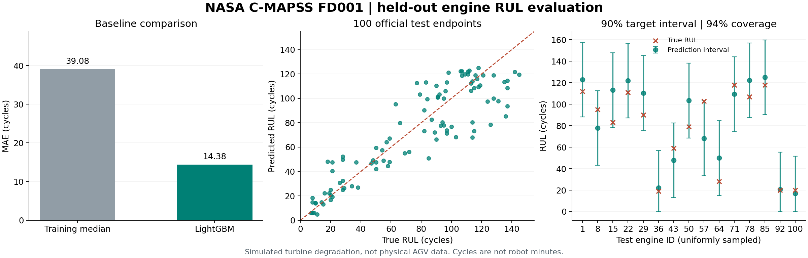

# NASA C-MAPSS FD001 잔여수명 실험

실험일: 2026-10-07. 결과 원본: [cmapss_fd001.json](cmapss_fd001.json).

## 데이터와 과제

[NASA 공개 데이터](https://catalog.data.gov/dataset/cmapss-jet-engine-simulated-data)의 FD001 사용. 엔진 열화 시뮬레이터에서 생성한 학습 엔진 100대, 테스트 엔진 100대의 시계열. 실제 AGV·공장 센서 데이터와 구분.

입력은 운전 조건 3개·센서 21개·관측 cycle. 과제는 테스트 엔진의 마지막 관측 시점에서 고장까지 남은 운전 cycle 예측. 초·분으로 변환하지 않음.

공식 [NASA 아카이브](https://data.nasa.gov/docs/legacy/CMAPSSData.zip?download=1)에서 FD001 파일만 추출. 아카이브 SHA-256:

```text
74bef434a34db25c7bf72e668ea4cd52afe5f2cf8e44367c55a82bfd91a5a34f
```

파일별 해시와 출처는 결과 JSON에 기록. 원본 데이터와 모델 실험 파일은 `data/` 아래 로컬 보관, Git에서 제외.

## 평가 절차

1. 학습 엔진을 fit 60대 / 모델 선택 20대 / 구간 보정 20대로 분리. 엔진 ID 중복 없음.
2. 현재 시점 입력과 과거 20시점 통계 입력, LightGBM leaves 15/31 조합의 후보 4개 비교. 미래 센서 관측·엔진 ID는 모델 입력에서 제외.
3. 모델 선택·구간 보정에서는 엔진마다 수명 40~85% 지점에 하나의 가상 관측 종료점 생성. 고장 시각은 정답 계산에만 사용.
4. 선택 엔진의 **상한 없는 RUL RMSE**로 후보 선택. 선택된 모델을 fit+선택 엔진 80대로 재학습. 보정 엔진 20대는 학습에서 제외.
5. 보정 엔진 종료점의 절대오차로 split-conformal 구간 구성. 목표 포함률 90%, 유한 표본 순위 보정 적용.
6. 공식 테스트 데이터·정답은 후보 선택 이후 읽기. 테스트 엔진당 마지막 관측점 하나로 평가. 테스트 정답에는 125-cycle 상한을 적용하지 않음.

학습 목표·점 예측의 상한은 125 cycle. 기준선은 재학습 데이터의 capped target 중앙값 103 cycle. 엔진별 샘플 가중치 합을 동일하게 적용해 긴 시계열의 과대표집 완화.

학습/테스트 파일의 숫자 ID 1~100은 서로 다른 엔진 집단의 ID. 숫자 일치와 동일 자산 누수를 구분.

## 측정 결과

| 지표 | 중앙값 기준선 | 선택된 LightGBM |
|---|---:|---:|
| MAE · cycle | 39.0800 | **14.3798** |
| RMSE · cycle | 49.8199 | **18.7331** |

단순 중앙값 기준선 대비 MAE 63.2% 감소. 기존 AGV 모델의 이전/이후 비교나 최신 연구 모델 대비 우수성을 의미하지 않음.

| 추가 지표 | 결과 |
|---|---:|
| 목표 구간 포함률 | 90% |
| 테스트 구간 포함률 | 94% · 100개 종료점 중 94개 |
| 평균 구간 폭 | 65.9712 cycle |
| 고장 시각을 늦게 예측한 비율 | 46% |
| 절대오차 95백분위 | 35.9195 cycle |

선택 모델은 **snapshot 특징 + leaves 31**. 이번 분할에서는 rolling 통계 모델보다 현재 센서값 모델의 선택 오차가 낮았음. 후보별 수치는 JSON에 공개.



## 재현

저장소 루트, `requirements.txt` 설치 환경에서 실행.

```bash
python scripts/download_cmapss.py
python src/cmapss_benchmark.py --seed 42 --lookback 20 --rounds 350
python scripts/plot_rul_benchmark.py
```

이미 받은 공식 ZIP 사용:

```bash
python scripts/download_cmapss.py --archive /path/to/CMAPSSData.zip
```

원본이 변경되면 체크섬 불일치로 추출 중단. 실행 결과는 `docs/benchmarks/cmapss_fd001.json`, 모델은 `data/experiments/cmapss-fd001/`에 저장. 측정 환경은 Python 3.13, LightGBM 4.6.0, scikit-learn 1.8.0, NumPy 2.4.4, pandas 3.0.2.

관제의 **데이터·AI** 탭에서 엔진 선택·최근 30-cycle 예측/정답/구간 비교 제공. `/api/benchmarks/rul`은 요약, `/api/benchmarks/rul/engines/{unit}`은 엔진별 결과 제공. 실시간 재추론이 아닌 저장된 평가 결과 조회.

## 해석 한계

- FD001의 단일 운전 조건·고장 모드 평가. FD002~FD004 및 실제 설비 일반화 검증 미수행.
- 시뮬레이션 엔진 센서와 서비스 로봇 센서의 도메인·단위 차이. AGV 운영 모델 자동 전환 금지.
- 구간 폭이 평균 약 66 cycle로 넓음. 높은 포함률만으로 정밀한 예측이라고 판단 불가.
- 가상 종료점은 수명 비율로 구성. 공식 테스트의 관측 종료 분포와 같다는 보장 없음.
- conformal 보장은 교환가능성 조건에 의존. 운전 조건 변화·도메인 이동 시 포함률 보장 불가.
- 최근 30-cycle 그래프의 구간은 종료점 기반 보정값 사용. 전체 시계열 각 시점의 포함률은 별도 미평가.

원 논문: [Saxena et al. (2008), Damage Propagation Modeling for Aircraft Engine Run-to-Failure Simulation](https://ntrs.nasa.gov/api/citations/20090029214/downloads/20090029214.pdf?attachment=true).
